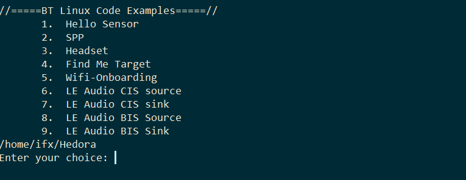
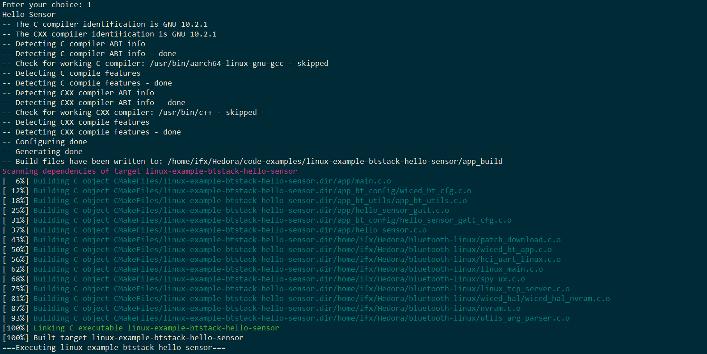

# Linux Bluetooth® SDK package 

This contains all the required files (including AIROC™ Bluetooth® stack for ARMv8 Linux, BT porting layer, sample code examples with profiles) to evaluate and test Bluetooth® Classic and Low Energy on AIROC™ combo chip (CYW4373, CYW43439, CYW5557X).
Also CYW5557X capable of LE Audio in hosted mode.

# Build, Download and running the application
Download the zip file, extract and run the BT_Linux_CE.sh with AIROC™ combo chip (CYW4373/CYW43439/CYW5557X) as argument to compile, build and run the required application.

Example:
Run "sudo ./BT_Linux_CE.sh CYW5557X" on RPI CM4 host machine and select the application from the menu:

For example, to compile, build and run Hello Sensor application select option 1 and as shown in below image it will compile, build and run the application.

Please refer individual code example Readme.md  files for experimenting with applications
	
Other code examples can be found here, that can be ported to the SDK (currently not tested as part of this release)

https://github.com/Infineon/linux-example-btstack-a2dp-source

https://github.com/Infineon/linux-example-btstack-a2dp-sink

https://github.com/Infineon/linux-example-btstack-handsfree-unit

https://github.com/Infineon/linux-example-btstack-handsfree-ag

https://github.com/Infineon/linux-example-btstack-wakeonle

https://github.com/Infineon/linux-example-btstack-bas

https://github.com/Infineon/linux-example-btstack-alert-client

https://github.com/Infineon/linux-example-btstack-alert-server
