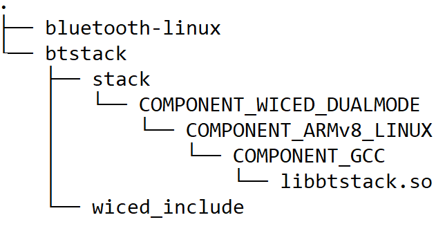

# BT Stack porting layer for Linux based Platform

## Overview
The bluetooth-Linux is the adaptation layer (porting layer) between the Linux BT application code example and Infineon's btstack running on the Linux based platforms.
The porting layer provides bluetooth stack initialization and implements platform interfaces to provide OS, memory services
and enables communication between the BTSTACK and the BT controller.


## Platform HCI transport config
Application shall call **cy_platform_bluetooth_init( )** API to initialize the porting layer before calling any stack API.
This API initializes and configures the UART device with  parameters from application and opens the serial device specified by application to enable communication with the BT Controller.
This API can also be used to download the firmware patch if needed by passing the patch file and the patch baudrate.

*  API **cy_platform_bluetooth_init( )**

## Debug configuration
Application shall call **cy_bt_spy_comm_init( )** API  with required parameters to collect the traces on BTSpy.

*  API **cy_bt_spy_comm_init( )**

## Design
* During stack initialization,function pointer of the platform interfaces gets registered with the stack to use the system resources i.e Memory, mutex.
The porting layer also registers functions that send data from stack to controller.
* Porting layer send HCI command and data  to the controller by calling  SendCommandToBtHCI and SendAclToBtHCI functions.
* Porting layer receives  HCI event and data from the BT controller by calling ProcessEventFromHCI and ProcessAclFromHCI functions and
then passes the event/data to btstack using which does further processing.

## How to build Linux porting layer

1. Create a directory under `$HOME` on the host PC and switch to the created directory. For example, use the following commands to switch:
   ```
   mkdir $HOME/Linux_BT
   cd $HOME/Linux_BT
   ```

2. Fetch the code example source code from GitHub.
   ```
   git clone https://github.com/Infineon/bluetooth-linux --branch release-v1.0.0
   ```

3. Clone the code example dependencies (BTSTACK library and Linux porting layer source code) using the following commands:
   ```
   git clone https://github.com/Infineon/btstack --branch release-v3.6.0
   ```

   Three different directories are created after cloning the code example and its dependencies as shown in the **Figure 1**.

   **Figure 1. Code example directory structure**

   

4. Create the build folder under the code example source folder and build the code example using the following commands:
   ```
   cd $HOME/Linux_BT/bluetooth-linux
   mkdir build && cd build
   cmake -DCMAKE_C_COMPILER:PATH=<GCC_CROSS_COMPILER> -DWICED_INCLUDE=../btstack/wiced_include ../ && make
   ```
   Where,
   - `GCC_CROSS_COMPILER` is the target cross compiler for GCC (generally */usr/bin/aarch64-linux-gnu-gcc* for ARM64-based targets)

   The porting layer library is generated under the *build* folder: **liblinux_stack_porting_layer.a**.

## Linux Audio
   * `linux-audio` folder contains the ALSA lib header and the pre-build dynamic library for ARM64 and copy from GitHub [alsa-lib](https://github.com/alsa-project/alsa-lib)
   * This part is for Linux platform speaker and mic control using.
   * you can go the [ALSA project](https://www.alsa-project.org/wiki/ALSA_Library_API) GitHub for getting more information.

## Additional Information
For Bluetooth Host Stack Library APIs, refer to the [BLE API reference manual](https://infineon.github.io/btstack/ble/api_reference_manual/html/index.html).

For BTSTACK Library, refer to the [BTSTACK Library](https://github.com/Infineon/btstack).


============

(c) (2022), Cypress Semiconductor Corporation (an Infineon company) or an affiliate of Cypress Semiconductor Corporation.  All rights reserved.
This software, including source code, documentation and related materials ("Software") is owned by Cypress Semiconductor Corporation or one of its affiliates ("Cypress") and is protected by and subject to worldwide patent protection (United States and foreign), United States copyright laws and international treaty provisions.  Therefore, you may use this Software only as provided in the license agreement accompanying the software package from which you obtained this Software ("EULA").
If no EULA applies, Cypress hereby grants you a personal, non-exclusive, non-transferable license to copy, modify, and compile the Software source code solely for use in connection with Cypress's integrated circuit products.  Any reproduction, modification, translation, compilation, or representation of this Software except as specified above is prohibited without the express written permission of Cypress.
Disclaimer: THIS SOFTWARE IS PROVIDED AS-IS, WITH NO WARRANTY OF ANY KIND, EXPRESS OR IMPLIED, INCLUDING, BUT NOT LIMITED TO, NONINFRINGEMENT, IMPLIED WARRANTIES OF MERCHANTABILITY AND FITNESS FOR A PARTICULAR PURPOSE. Cypress reserves the right to make changes to the Software without notice. Cypress does not assume any liability arising out of the application or use of the Software or any product or circuit described in the Software. Cypress does not authorize its products for use in any products where a malfunction or failure of the Cypress product may reasonably be expected to result in significant property damage, injury or death ("High Risk Product"). By including Cypress's product in a High Risk Product, the manufacturer of such system or application assumes all risk of such use and in doing so agrees to indemnify Cypress against all liability.
