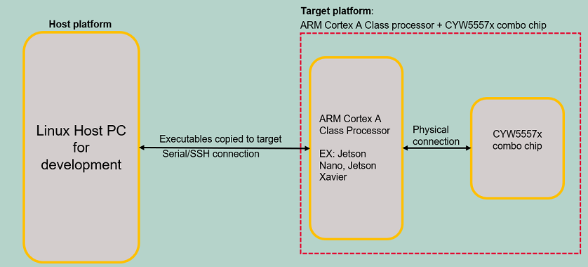
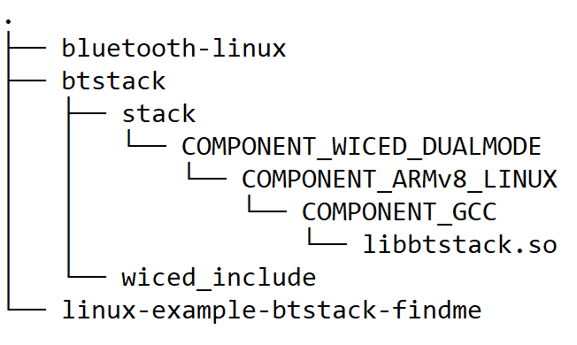
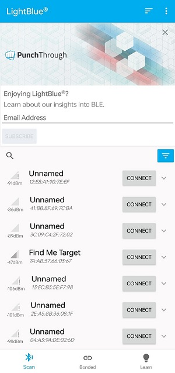
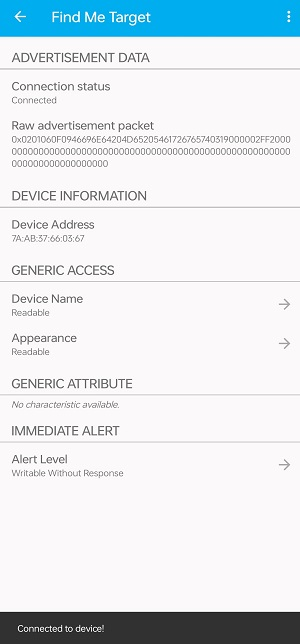
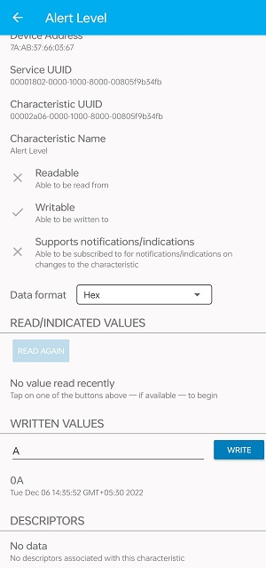
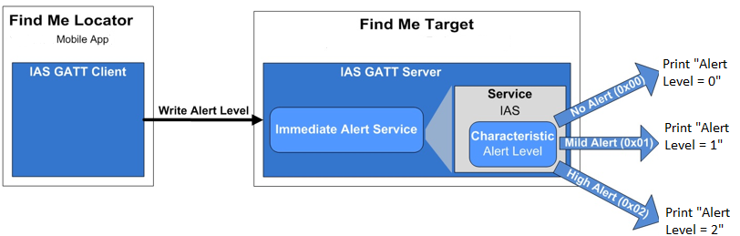
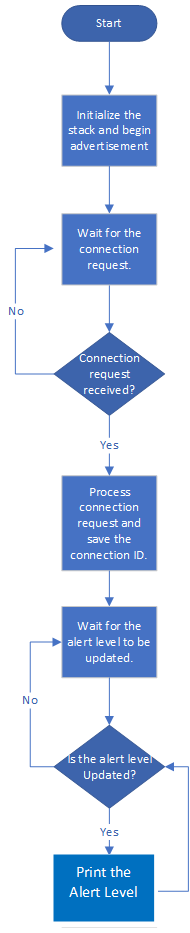

# AIROC&trade; CYW5557x: Bluetooth&reg; LE Find Me Target (Linux)

This code example demonstrates Bluetooth&reg; LE Find Me Target using AIROC™ CYW5557x Wi-Fi & Bluetooth® combo chip on the Linux platform.

## Requirements

- Programming language: C
- One of the following embedded Linux platforms (Arm® Cortex®-A Class processors) for host communications
  1.  [Rpi CM4 IFX custom HW](https://confluencewikiprod.intra.infineon.com/display/ILA/Rpi+CM4+IFX+custom+HW) from Infineon
  2. IMX8-NANO embeddedartists board
  3. Jetson Xavier NX board
- AIROC™ BTSTACK library and Linux porting layer source code
- Associated parts: [AIROC™ CYW5557x Wi-Fi & Bluetooth® combo chip](https://www.infineon.com/cms/en/product/wireless-connectivity/airoc-wi-fi-plus-bluetooth-combos/cyw5557x)


## Supported toolchains (make variable 'TOOLCHAIN')

- GNU Arm® GCC AArch64 v9.3.0 (`GCC_ARM`)

<mark>Check and update with the version that is compatible with all libraries required by the application.

## Hardware setup

Set up the hardware according to the following diagram:

**Figure 1. Block diagram: Hardware setup**



See [Rpi+H2](https://confluencewikiprod.intra.infineon.com/pages/viewpage.action?pageId=676350602#Rpi+H2-Firmwaredownload&BTStackbringup) to learn how to set up the CYW5557x device.

<mark> This link is internal as of now but it needs to be updated with public document while releasing the code example to customer.

## Software setup

Set up a cross compiler according to the target platform along with CMake on the host PC based on Ubuntu 18.04.

<mark>*These steps are for arm64 based target platform. Please review these steps before adding support for any other target*

1. Open a terminal on the Ubuntu host PC.

2. Use the following command to install the cross compiler, build tools, and dependencies:
   ```
   sudo apt-get install git cmake gcc-aarch64-linux-gnu build-essential -y
   ```
3. To use an iOS or Android Smartphone as the Find Me Locator, download the LightBlue app. Scan the following QR codes from your mobile phone to download the LightBlue app.

   **Figure 3. Application QR code**

   

## Using the code example

Do the following on the Host PC to compile the code example:

1. Create a directory under `$HOME` on the host PC and switch to the created directory. Use the following commands, for example:
   ```
   mkdir $HOME/Linux_CE
   cd $HOME/Linux_CE
   ```
   **Note:** Replace *Linux_CE* with a directory of your choice.

2. Fetch the code example source code using the following command:
   ```
   git clone http://devops-git.aus.cypress.com/wpp/ce/linux/linux-example-btstack-findme.git --branch topic/linux_ce_findme_v1.0.0
   ```
   <mark> Above link is of internal repo as of now but it needs to be updated with public repo while releasing the code example to customer.

3. Clone the code example dependencies (BTSTACK library and Linux porting layer source code) using the following commands:
   ```
   git clone https://gitlab.auc.infineon.com/repo-staging/btstack.git --branch btstack360
   git clone https://gitlab.intra.infineon.com/repo-staging/bluetooth-linux --branch 3.6.0.12
   ```
   <mark> Above link is of internal repo as of now but it needs to be updated with public repo while releasing the code example to customer.

   Three different directories are created after cloning the code example and its dependencies - see the following example:

   **Figure 2. Code example directory structure**

   

4. Create the build folder under the code example source folder and build the code example using the following commands:
   ```
   cd $HOME/Linux_CE/linux-example-btstack-findme
   mkdir build && cd build
   cmake -DCMAKE_C_COMPILER:PATH=<GCC_CROSS_COMPILER> ../ && make
   ```
   Where,
   - `GCC_CROSS_COMPILER` is the target cross compiler for GCC (generally */usr/bin/aarch64-linux-gnu-gcc* for ARM64-based targets)

   The code example executable is generated under the *build* folder with the same name of code example.

   For example, in this project, the "linux-findme" executable is generated at */home/$USER/Linux_CE/linux-example-btstack-findme/build*.

## Operation

**Devices used:**

- **Device Under Test (DUT):** Linux Platform Jetson Xavier/Nano, IMX8 Nano and RPI4 with AIROC™ CYW5557x (target platform).
Implements: "Find Me Target", GATT Server, GAP Peripheral role

- **Testing Device:** Mobile (Android or iOS) with CySmart application.
Used as: "Find Me locator", GATT Client. GAP Central role

1. Copy the code example executable and AIROC™ BTSTACK library from the host PC to the target platform using [SCP](https://help.ubuntu.com/community/SSH/TransferFiles). For example, use the following commands:
   ```
   cd $HOME/Linux_CE/linux-example-btstack-findme/build
   scp linux-findme <TARGET_USER>@<TARGET_IP>:<TARGET_PATH>/.
   cd $HOME/Linux_CE/btstack/stack/COMPONENT_WICED_DUALMODE/COMPONENT_ARMv8_LINUX/COMPONENT_GCC
   scp libbtstack.so <TARGET_USER>@<TARGET_IP>:<TARGET_PATH>/.
   ```
   Where,
   - `TARGET_USER` is the user name of the target platform
   - `TARGET_IP` is the IP address of the target platform
   - `TARGET_PATH` is the path of target platform


2. Porting Layer


3. Log in to  target Jetson Xavier board using ssh. Execute all below command on target Xavier board,IMX8 Nano and RPI4.
   ```
   ssh <TARGET_DEVICE_USER_NAME>@<TARGET_DEVICE_IP_ADDRESS>
   ```

4. Add udev rule in Target Host board for HCI UART and GPIO to bypass root access. Use following steps to create and setup a udev rule.
	
	 Note: If user has root access, then the below udev rules are not required, and user can execute the code example with sudo.
	
	1.Create a new .rules (For an example "cyw5557x-uart-port.rules") file under "/etc/udev/rules.d/" directory. Use below command for IMX8 NANO/RPI CM4/Jetson XAVIER.

	```
	vim /etc/udev/rules.d/cyw5557x-uart-port1.rules
	```
	   1.1 Add below line for IMX8-NANO

	   ```
	   KERNEL=="ttymxc0",SYMLINK+="cyw5557x_uart",MODE="0666"
	   ```
	   1.2 Add below line for RPI4 CM4

	   ```
	   KERNEL=="ttyAMA0",SYMLINK+="cyw5557x_uart",MODE="0666"
	   ```
	   1.3 Add below line for Jetson XAVIER

	   ```
	   KERNEL=="ttyTHS1",SYMLINK+="cyw5557x_uart",MODE="0666"
	   ```
	
	2.Create new .rules for gpiochip under "/etc/udev/rules.d/".Use below command for IMX8-NANO/RPI CM4/Jetson XAVIER.

	2.1 For IMX8-NANO & RPI
	```
	vim /etc/udev/rules.d/90-gpio.rules
	```
	2.1.1.Add below line.
	```
	SUBSYSTEM=="gpio*", PROGRAM="/bin/sh -c 'chown -R $user:$group /sys/class/gpio/export /sys/class/gpio/unexport;'"
	SUBSYSTEM=="gpio*", PROGRAM="/bin/sh -c 'chown -R $user:$group /sys%p/direction /sys%p/value; chmod 660 /sys%p/direction /sys%p/value;'"

	```
	2.2 For Jetson XAVIER
	```
	vim /etc/udev/rules.d/cyw5557x-gpiochip0.rules
	```
	2.2.1.Add below line for Jetsen Xavier.

	```
	SUBSYSTEM=="gpio*", PROGRAM="/bin/sh -c 'chown -R ifx:gpio /dev/gpiochip0; chmod -R 770 /dev/gpiochip0;'"
	```
	```
	vim /etc/udev/rules.d/cyw5557x-gpiochip1.rules
	```
	2.2.2. Add below line for Jetson Xavier.

	```
	SUBSYSTEM=="gpio*", PROGRAM="/bin/sh -c 'chown -R ifx:gpio /dev/gpiochip1; chmod -R 770 /dev/gpiochip1;'"
	```
	
	3. Reboot the target device.
	```
	sudo reboot
	```

	Where,

	- ttyTHS1,ttymxc0,ttyAMA0 are the HCI UART port.

	- cyw5557x_bt_uart is friendly name of HCI UART port

	- 0666 is permission mask to bypass root access for HCI UART. User can remove MODE variable in above line to keep root access and just to give friendly name to HCI UART port.
	Note: If user skips MODE command in above step then he/she needs to use sudo before accessing HCI UART from application.
   
5. Execute the application using the following commands on the setup-1 target platform. These commands also set the paths of the AIROC™ BTSTACK library.
   ```
   cd <TARGET_PATH>
   LD_LIBRARY_PATH=$LD_LIBRARY_PATH:<BTSTACK_LIB_PATH> ./<APP_NAME> -c <COM_PORT> -b 3000000 -f 921600 -r <GPIOCHIPx> <REGONPIN> -n -p <FW_FILE_NAME>.hcd -d 112233221133
   ```
   Where,
   - `TARGET_PATH` is the path of the target platform where the code example application copied
   - `BTSTACK_LIB_PATH` is path of the AIROC™ BTSTACK library. Skip this if the AIROC™ BTSTACK library and executable are in the same folder, and start the command with `./gatt_server` or `./gatt_client`)
   - `/dev/ttyTHS1` is the COM port for Jetson Xavier
   - `/dev/ttymxc0` is the COM port for IMX-NANO
   - `/dev/ttyAMA0` is the COM port for RPI CM4
   - `3000000` is HCI baud rate
   - `112233221133` is a device BD address
   - `-r <GPIOCHIPx> <REGONPIN> -n`  is setting the GPIO control to enable autobaud for Hatchet2
		- `-r gpiochip5 0 -n`  For IMX8-NANo	
		- `-r gpiochip0 3 -n`  For RPI CM4
		- `-r gpiochip1 16 -n`  For Jetson XAVIER	
   - `921600` is FW patch download baudrate
   - `.hcd` is FW patch to download (Make sure to validate this FW patch file path)

     **Note 1:** If user does not follow to setup udev rule mentioned in #4, then execute the command with sudo.  
     **Note 2:** Currently, random BD addresses are used for testing.

   Wait download hcd file 
   ```
   Download pathfile <FW-FILE-NAME>.hcd 
   patch_download_complete  
   ```

6. To test using the LightBlue mobile app, do the following (see equivalent LightBlue app screenshots in Figure 2 and Figure 3):

   1. Turn ON Bluetooth on your Android or iOS device.

   2. Launch the LightBlue app.

   3. Start the "Find Me Target" application on the Linux board as mentioned in Step 4 of the [Operation](#operation) section.

      The "Find Me Target" application on the Linux board will start advertising. Look for the following prints on the Linux console:

      ```
      Advertisement State Change: BTM_BLE_ADVERT_UNDIRECTED_HIGH
      ```
      Advertising will stop after 90 seconds if a connection has not been established.

   4. Swipe down on the LightBlue app home screen on the mobile to start scanning for Bluetooth&reg; LE peripherals; your device (“Find Me Target”) appears in the LightBlue app home screen. Select your device to establish a Bluetooth&reg; LE connection.

   5. Select the "Find Me Profile" from the carousel view of the Mobile LightBlue application.

   6. Select an Alert Level value on the "Find Me Profile" screen of the Mobile LightBlue Application. Observe the prints "Alert Level = " on the Linux console.

      **Figure 2. Testing with the LightBlue app on iOS**

      

      <br>

      **Figure 3. Testing with the LightBlue app on Android**

      
      

## Debugging

You can debug the example using a generic Linux debugging mechanism such as the following:

- **Debugging by logging:** Add prints in the application and check them during the execution.

- **Debugging using GDB:** See [GDB man page](https://linux.die.net/man/1/gdb) for more details.

## Design and implementation

**Roles implemented:**

- **CE code example (implementation under test):** Find Me Target, GATT Server, and GAP Peripheral role

- **Testing mobile device with LightBlue app:** Find Me Locator, GATT Client, and GAP Central role

**Find Me Profile (FMP) working:**

   The ‘Find Me Locator’ (the Bluetooth&reg; LE Central device) is a Bluetooth&reg; LE GATT Client. The ‘Find Me Target’ (the Peripheral device) is a Bluetooth&reg; LE GATT Server with the IAS implemented, as Figure 4 shows.

   **Figure 4. Find Me Profile (FMP) implementation**

   

   <sub>*IAS: Immediate Alert Service*<sub>

   The Bluetooth&reg; LE Find Me Profile defines what happens when the locating Central device broadcasts a change in the alert level.

   The Find Me Locator connects to the Find Me Target and performs service discovery using the "GATT Discover All Primary Services" procedure. The Bluetooth&reg; LE Service Characteristic discovery is done by the "Discover All Characteristics of a Service" procedure. When the Find Me Locator wants to cause an alert on the Find Me Target, it writes an alert level in the Alert Level characteristic of the IAS. When the Find Me Target receives an alert level, it indicates the level by printing the alert level on the console.

This code example does the following:

1. Parses the command-line arguments and initializes the AIROC™ BTSTACK library for the CYW5557x device

2. On starting the "Find Me target" Code example, the target application will start advertising. and waits for the connection to be established from the remote "Find Me Locator" mobile application. Advertising will stop after 90 seconds if a connection has not been established.

3. Implements Bluetooth&reg; LE "Find Me target" and GATT Server (GAP Peripheral role).

4. Responds to the GATT service and characteristic discovery, and when the remote Find Me Locator mobile application writes the alert level, the Find Me target Code example prints the same on the console.

5. On disconnection, the Find Me Target application starts advertising again so that the Find Me Locator can connect again.

6. The Find me Target application waits until interrupted or closed.

   **Figure 5. Find Me Target program flowchart**

   

**Note:** Run the application without any arguments to get details of command-line arguments.

## Source files

 Files   | Description of Files
 ------- | ---------------------
 *main.c*  | Implements the main function which takes the user command-line inputs. Uses *arg_parser.c* to parse all the command-line inputs from the user. Calls the *findme.c* functions for all the Find Me profile functionalities.
 *arg_parser.c*  | Contains the code to parse the command-line arguments from the user and its related functionalities.
 *arg_parser.h*  | Header file corresponding to *arg_parser.c*
 *app_bt_utils.c*  | Contains all the utility functions. For example, it contains functions to print error codes, status, etc. in a user-understandable format.
 *app_bt_utils.h*  | Header file corresponding to *app_bt_utils.c*
 *findme.c*  | Implements all functionalities related to Find Me Target.
 *findme.h*  | Header file corresponding to *findme.c*.
 *GeneratedSource*  | All files in this folder are pre-generated using “Bluetooth&reg; Configurator” on Windows. All files in this folder contain configurations related to Bluetooth&reg; settings, GAP, and GATT db.

## Resources and settings

This section explains the Bluetooth&reg; Configurator software resources and their configuration as used in this code example. Note that all the configuration explained in this section has already been done in the code example.

**Bluetooth&reg; Configurator:** The Bluetooth&reg; peripheral has an additional configurator called the “Bluetooth&reg; Configurator” that is used to generate the Bluetooth&reg; LE GATT database and various Bluetooth&reg; settings for the application. These settings are stored in the file named *design.cybt*.

**Table 1. Application resources**

 Resource  |  Alias/object     |    Purpose
 :-------- | :-------------    | :------------
 UART |HCI| UART is used for HCI communication with host system

<br>

## Related resources

<mark>Replace the internal links with the public links.

Resources  | Links
-----------|----------------------------------
Device documentation | [CYW5557x](https://www.infineon.com/cms/en/product/wireless-connectivity/airoc-wi-fi-plus-bluetooth-combos/cyw5557x/)
Getting started  | [CYW5557x with Jetson Xavier](https://confluencewikiprod.intra.infineon.com/display/ILA/CYW55572+Hatchet-2+ES10.4+L2+Apps)
AIROC™ BTSTACK library | [AIROC™ BTSTACK library](https://devops-git.aus.cypress.com/repo-staging/btstack/-/tree/btstack360)
Linux porting layer source code | [Linux porting layer source code](https://devops-git.aus.cypress.com/repo-staging/bluetooth-linux/-/tree/3.6.0.12)


## Other resources

Infineon provides a wealth of data at [www.infineon.com](https://www.infineon.com/) to help you select the right device, and quickly and effectively integrate it into your design.


## Document history

Document title: CExxxxXx – *AIROC&trade; CYW5557x: Bluetooth&reg; LE Find Me Target (Linux)*

 Version | Description of change
 ------- | ---------------------
 1.0.0   | New code example
 1.1.0   | Integration with porting layer 360|

<br>

---------------------------------------------------------

© Cypress Semiconductor cCorporation, 2022. This document is the property of Cypress Semiconductor Corporation, an Infineon Technologies company, and its affiliates ("Cypress").  This document, including any software or firmware included or referenced in this document ("Software"), is owned by Cypress under the intellectual property laws and treaties of the United States and other countries worldwide.  Cypress reserves all rights under such laws and treaties and does not, except as specifically stated in this paragraph, grant any license under its patents, copyrights, trademarks, or other intellectual property rights.  If the Software is not accompanied by a license agreement and you do not otherwise have a written agreement with Cypress governing the use of the Software, then Cypress hereby grants you a personal, non-exclusive, nontransferable license (without the right to sublicense) (1) under its copyright rights in the Software (a) for Software provided in source code form, to modify and reproduce the Software solely for use with Cypress hardware products, only internally within your organization, and (b) to distribute the Software in binary code form externally to end users (either directly or indirectly through resellers and distributors), solely for use on Cypress hardware product units, and (2) under those claims of Cypress’s patents that are infringed by the Software (as provided by Cypress, unmodified) to make, use, distribute, and import the Software solely for use with Cypress hardware products.  Any other use, reproduction, modification, translation, or compilation of the Software is prohibited.
<br>
TO THE EXTENT PERMITTED BY APPLICABLE LAW, CYPRESS MAKES NO WARRANTY OF ANY KIND, EXPRESS OR IMPLIED, WITH REGARD TO THIS DOCUMENT OR ANY SOFTWARE OR ACCOMPANYING HARDWARE, INCLUDING, BUT NOT LIMITED TO, THE IMPLIED WARRANTIES OF MERCHANTABILITY AND FITNESS FOR A PARTICULAR PURPOSE.  No computing device can be absolutely secure.  Therefore, despite security measures implemented in Cypress hardware or software products, Cypress shall have no liability arising out of any security breach, such as unauthorized access to or use of a Cypress product. CYPRESS DOES NOT REPRESENT, WARRANT, OR GUARANTEE THAT CYPRESS PRODUCTS, OR SYSTEMS CREATED USING CYPRESS PRODUCTS, WILL BE FREE FROM CORRUPTION, ATTACK, VIRUSES, INTERFERENCE, HACKING, DATA LOSS OR THEFT, OR OTHER SECURITY INTRUSION (collectively, "Security Breach").  Cypress disclaims any liability relating to any Security Breach, and you shall and hereby do release Cypress from any claim, damage, or other liability arising from any Security Breach.  In addition, the products described in these materials may contain design defects or errors known as errata which may cause the product to deviate from published specifications. To the extent permitted by applicable law, Cypress reserves the right to make changes to this document without further notice. Cypress does not assume any liability arising out of the application or use of any product or circuit described in this document. Any information provided in this document, including any sample design information or programming code, is provided only for reference purposes.  It is the responsibility of the user of this document to properly design, program, and test the functionality and safety of any application made of this information and any resulting product.  "High-Risk Device" means any device or system whose failure could cause personal injury, death, or property damage.  Examples of High-Risk Devices are weapons, nuclear installations, surgical implants, and other medical devices.  "Critical Component" means any component of a High-Risk Device whose failure to perform can be reasonably expected to cause, directly or indirectly, the failure of the High-Risk Device, or to affect its safety or effectiveness.  Cypress is not liable, in whole or in part, and you shall and hereby do release Cypress from any claim, damage, or other liability arising from any use of a Cypress product as a Critical Component in a High-Risk Device. You shall indemnify and hold Cypress, including its affiliates, and its directors, officers, employees, agents, distributors, and assigns harmless from and against all claims, costs, damages, and expenses, arising out of any claim, including claims for product liability, personal injury or death, or property damage arising from any use of a Cypress product as a Critical Component in a High-Risk Device. Cypress products are not intended or authorized for use as a Critical Component in any High-Risk Device except to the limited extent that (i) Cypress’s published data sheet for the product explicitly states Cypress has qualified the product for use in a specific High-Risk Device, or (ii) Cypress has given you advance written authorization to use the product as a Critical Component in the specific High-Risk Device and you have signed a separate indemnification agreement.
<br>
Cypress, the Cypress logo, and combinations thereof, WICED, ModusToolbox, PSoC, CapSense, EZ-USB, F-RAM, and Traveo are trademarks or registered trademarks of Cypress or a subsidiary of Cypress in the United States or in other countries. For a more complete list of Cypress trademarks, visit cypress.com. Other names and brands may be claimed as property of their respective owners.
