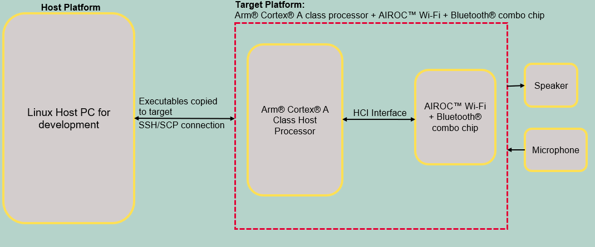
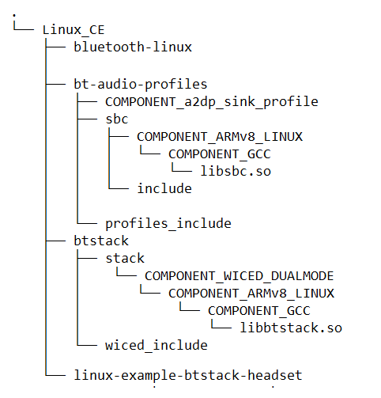
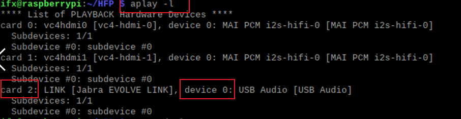
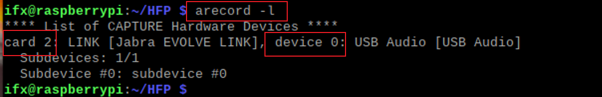
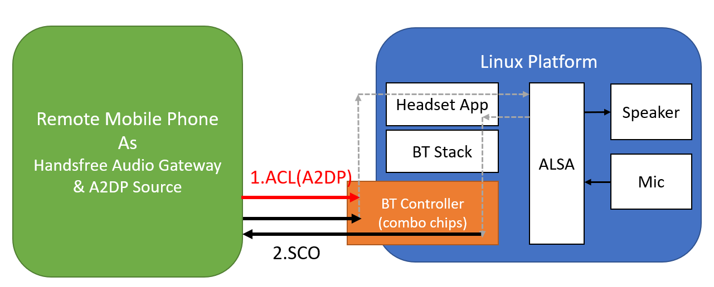

# AIROC™ BTSTACK: Bluetooth® headset for Linux host

This code example demonstrates the implementation of a Bluetooth® headset with the AIROC™ Wi-Fi & Bluetooth® combo chip using Embedded Linux platforms (Arm® Cortex®-A Class processors).


[View this README on GitHub.](replace_code_example_github_readme_url)

[Provide feedback on this code example.](replace_code_example_voc_survey_url)

## Requirements

- Programming language: C
- Embedded Linux Host platforms (Arm® Cortex®-A Class processors). Supported Embedded Linux host platforms:
   1. RPI CM4-lite with custom HW base board from Infineon
   2. [IMX8 nano uCOM board](https://www.embeddedartists.com/products/imx8m-nano-developers-kit-v3/) from Embedded Artists
- AIROC™ BTSTACK library and Linux porting layer source code
- AIROC™ Wi-Fi & Bluetooth® combo chip Bluetooth® Firmware file (.hcd).
- Linux Host PC with Ubuntu 20.04

## Supported toolchains (make variable 'TOOLCHAIN')

- GNU Arm® GCC AArch64 v9.3.0 (`GCC_ARM`)

## Supported AIROC™ Wi-Fi & Bluetooth® combo chip

  - [AIROC™ CYW5557x Wi-Fi & Bluetooth® combo chip](https://www.infineon.com/cms/en/product/wireless-connectivity/airoc-wi-fi-plus-bluetooth-combos/wi-fi-6-6e-802.11ax/)


## Hardware setup

Set up the hardware according to the following diagram:

**Figure 1. Block diagram: Hardware setup**



## Software setup

Set up a cross compiler according to the target platform along with CMake on the host PC based on Ubuntu 20.04.

<mark>*These steps are for arm64 based target platform. Please review these steps before adding support for any other target*

1. Open a terminal on the Ubuntu host PC.

2. Use the following command to install the cross compiler, build tools, and dependencies:

   ```bash
   sudo apt-get install git cmake gcc-aarch64-linux-gnu build-essential -y
   ```

## Using the code example

Do the following on the Linux host PC to compile the code example:

1. Create a directory under `$HOME` on the host PC and switch to the created directory. Use the following commands, for example:
   ```bash
   mkdir $HOME/Linux_CE
   cd $HOME/Linux_CE
   ```
   **Note:** Replace *Linux_CE* with a directory of your choice.

2. Fetch the code example source code using the following command:
   ```bash
   git clone https://gitlab.intra.infineon.com/tbst/linux_bt_ce/linux-example-btstack-headset.git --branch develop
   ```

3. Clone the code example dependencies (BTSTACK library and Linux porting layer source code) using the following commands:
   ```bash
   git clone https://github.com/Infineon/btstack --branch release-v3.7.1
   git clone https://gitlab.intra.infineon.com/repo-staging/bt-audio-profiles --branch 1.0.3743
   git clone https://gitlab.intra.infineon.com/repo-staging/bluetooth-linux.git --branch Hedorah-TC1
   git clone https://gitlab.intra.infineon.com/repo-staging/btsdk-gfps --branch develop
   ```

   Four different directories are created after cloning the code example and its dependencies - see the following example:

   **Figure 2. Code example directory structure**

   

4. Clone the Bluetooth® firmware using following command.
   ```bash
   git clone https://github.com/Infineon/combo-bluetooth-firmware.git
   ```
   User can choose appropriate Bluetooth® firmware for particular AIROC™ Wi-Fi & Bluetooth® combo chip from cloned "combo-bluetooth-firmware" directory.

5. Create the build folder under the code example source folder and build the code example using the following commands:
   ```
   cd $HOME/Linux_CE/linux-example-btstack-headset
   mkdir build && cd build
   cmake -DCMAKE_C_COMPILER:PATH=<GCC_CROSS_COMPILER> ../ && make
   ```
   Where,
   - `GCC_CROSS_COMPILER` is the target cross compiler for GCC (generally */usr/bin/aarch64-linux-gnu-gcc* for ARM64-based targets)

   The code example executable is generated under the *build* folder with the same name of code example.

   For example, in this project, the "linux-example-btstack-headset" executable is generated at */home/$USER/Linux_CE/linux-example-btstack-headset/build*.

##  Operation

This code example acts as a Headset. The remote device will be a mobile or laptop for Audio streaming or calling functionality.

Two devices are required to demonstrate this application:
One hardware platform (Linux host platform + AIROC™ Wi-Fi &  combo chip, i.e., the device running the Headset application) and a mobile or laptop.

1. Take SSH console of target platform.
   ```bash
   ssh <TARGET_DEVICE_USER_NAME>@<TARGET_DEVICE_IP_ADDRESS>
   ```

2. Copy the code example executable and AIROC™ BTSTACK library from the host PC to the target platform using [SCP](https://help.ubuntu.com/community/SSH/TransferFiles). For example, use the following commands:
   ```
   cd $HOME/Linux_CE/linux-example-btstack-headset/build
   scp linux-example-btstack-headset <TARGET_USER>@<TARGET_IP>:<TARGET_PATH>/.
   cd $HOME/Linux_CE/btstack/stack/COMPONENT_WICED_DUALMODE/COMPONENT_ARMv8_LINUX/COMPONENT_GCC
   scp libbtstack.so <TARGET_USER>@<TARGET_IP>:<TARGET_PATH>/.
   cd $HOME/Linux_CE/bt-audio-profiles/sbc/COMPONENT_ARMv8_LINUX/COMPONENT_GCC
   scp libsbc.so <TARGET_USER>@<TARGET_IP>:<TARGET_PATH>/.
   scp <FW_FILE.hcd> <TARGET_USER>@<TARGET_IP>:<TARGET_PATH>/.
   ```
   Where,
   - `TARGET_USER` is the user name of the target platform
   - `TARGET_IP` is the IP address of the target platform
   - `TARGET_PATH` is the path of the target platform
   - `FW_FILE.hcd` file is Bluetooth® Firmware file cloned in [Using the code example section](#using-the-code-example).

3. Add the udev rule in the target host board for HCI UART and GPIO to bypass root access. Use the following steps to create and set up a udev rule.

   **Note:** If you have root access, the following udev rules are not required; you can execute the code example with `sudo` permissions or by switching to the root user.

   1. Create a new *.rules* (for example, *combo-chip-uart-port.rules*) file under */etc/udev/rules.d/* directory for HCI UART. Use the following commands:

      **IMX8Nano:**

      ```bash
      echo "KERNEL==\"ttymxc0\"d,SYMLINK+=\"combo_chip_uart\",MODE=\"0666\"" | sudo tee /etc/udev/rules.d/combo-chip-uart-port.rules
      ```

      **RPICM4:**

      ```bash
      echo "KERNEL==\"ttyAMA0\",SYMLINK+=\"combo_chip_uart\",MODE=\"0666\"" | sudo tee /etc/udev/rules.d/combo-chip-uart-port.rules
      ```

   2. Create new *.rules* (for example, *combo-chip-gpio-port.rules*) for BT_REG_ON GPIO under */etc/udev/rules.d/*. Use the following commands:

      **IMX8Nano & RPICM4:**

      1. Create a rule file using the following command.

         ```bash
         sudo vim /etc/udev/rules.d/combo-chip-gpio-port.rules.rules
         ```

      2. Add the following rules in created files:

         ```bash
         SUBSYSTEM=="gpio*", PROGRAM="/bin/sh -c 'chown -R $user:$group /sys/class/gpio/export /sys/class/gpio/unexport;'"
         SUBSYSTEM=="gpio*", PROGRAM="/bin/sh -c 'chown -R $user:$group /sys%p/direction /sys%p/value; chmod 660 /sys%p/direction /sys%p/value;'"
         ```

   3. Reboot the target device:

      ```bash
      sudo reboot
      ```

       Where,

      - `ttymxc0`, and `ttyAMA0` are HCI UART ports for IMX8Nano and RPICM4 respectively
      - `combo_chip_uart` is a friendly name for the HCI UART port
      - `0666` is the permission mask to bypass the root access for HCI UART

4. Check and configure the ALSA playback sound card and record sound card settings.

   1. Use `aplay -l` to check which card you need to be used for audio playback.

        
      For an example, if user want to choose card 2 device 0, User should set pcm `hw:2,0`

   2. Use `arecord  -l` to which card need to be used for audio record.

        
      For an example, if user want to choose card 2 device 0, User should set ctl `hw:2,0`
   3. Modify or add an ALSA setting file ~/.asoundrc and add the below setting, the number of pcm `hw:X,X`  and ctl `hw:Y,Y`  should refer above sound card information.

      ```bash
      pcm.!default {
         type plug
         slave {
            pcm "hw:3,0"
         }
      }
      ctl.!default {
         type plug
         slave {
            ctl "hw:3,0"
         }
      }
      ```
      Where,  
         * pcm "hw:3,0" is your card number check use the aplay -l cmd  
         * ctl "hw:3,0" is your card number checked using the record -l cmd
   4. Use following commands to test card configurations done using above steps. If the card set-up is successful, User can record and playback the audio file successfully.
      ```bash
      arecord -f S16_LE -r 8000 -c 2 -d 3 mic_test.raw
      aplay mic_test.raw
      ```
      `Note: use the same user to set up the ALSA setting and launch the code example, ex: don't use sudo to set-up ALSA setting and launch code example without sudo`
   4. Check the ALSA mixer setting using the below command:
   ```bash
   amixer scontrols
   ```   
  :
   ```
   Simple mixer control 'Headphone',0
   Simple mixer control 'Sidetone',0
   Simple mixer control 'Mic',0
   Simple mixer control 'Extension Unit',0
   ```
   make sure the simple mixer control name is include in the alsa_amixer_name array in alsa_playback.c file, if not, please add it.
   ```
   static char* alsa_amixer_name[ALSA_MIXER_NAME_SIZE] = {
     "Speaker",
     "Master",
     "Headphone"
   };
   ```    

5. Execute the application with setting the paths of the AIROC™ BTSTACK library using the following command on the target platform:

   ```bash
   cd <TARGET_PATH>
   chmod +x <APP_NAME>
   LD_LIBRARY_PATH=$LD_LIBRARY_PATH:<BTSTACK_LIB_PATH>
   ./<APP_NAME> -c <COM_PORT> -b <HCI_BAUDRATE> -f <FW_DL_BAUDRATE> -r <GPIOCHIPx> <REGONPIN> -n -p <FW_FILE_NAME>.hcd -d 112233221144
   ```
   Where,
   - `TARGET_PATH` is the path of the target platform where the code example application copied to
   - `BTSTACK_LIB_PATH` is the path of the AIROC™ BTSTACK library. Skip this if the AIROC™ BTSTACK library and code example application executable are in the same folder
   - `COM_PORT` is the HCI communication port.
      - `/dev/ttymxc0` for IMX8Nano
      - `/dev/ttyAMA0` for RPICM4
   - `HCI_BAUDRATE` is the baud rate to be used for HCI communication.
      - `3000000` is the HCI baud rate for IMX8Nano
      - `921600` is the HCI baud rate for RPICM4
   - `112233221133` is a device BD address
   - `-r <GPIOCHIPx> <REGONPIN> -n`  is setting the GPIO control to program the Bluetooth® Firmware for AIROC™ Wi-Fi + Bluetooth® combo chip
      - `-r gpiochip5 0 -n`  For IMX8Nano
      - `-r gpiochip0 3 -n`  For RPICM4
   - `FW_DL_BAUDRATE` is the baud rate to be used for patch download; default value is 115200 if not specified. Different chips support different maximum download speed.
      - `921600` for [AIROC™ CYW5557x Wi-Fi & Bluetooth® combo chip](https://www.infineon.com/cms/en/product/wireless-connectivity/airoc-wi-fi-plus-bluetooth-combos/wi-fi-6-6e-802.11ax/)
      - `115200` for [AIROC™ CYW54591 Wi-Fi & Bluetooth® combo chip](https://www.infineon.com/cms/en/product/wireless-connectivity/airoc-wi-fi-plus-bluetooth-combos/wi-fi-5-802.11ac/cyw54591/)
      - `115200` for [AIROC™ CYW43439 Wi-Fi & Bluetooth® combo chip](https://www.infineon.com/cms/en/product/wireless-connectivity/airoc-wi-fi-plus-bluetooth-combos/wi-fi-4-802.11n/cyw43439/)
      - `115200` for [AIROC™ CYW43012 Wi-Fi & Bluetooth® combo chip](https://www.infineon.com/cms/en/product/wireless-connectivity/airoc-wi-fi-plus-bluetooth-combos/wi-fi-4-802.11n/cyw43012/)
   - `<FW_FILE_NAME>.hcd` is the firmware patch to download (make sure to validate this firmware patch file path)

     **Note 1:** If you haven't set up a udev rule mentioned in Step 4, execute the command with `sudo` permissions.

     **Note 2:** Currently, random BD addresses are used for testing.

6. When the code example is launched, a menu appears on the terminal as follows:

   ```bash
   ------------Headset MENU------------------------
   0.  Exit
   1.  Print Menu
   2.  Set Visibility
   3.  Set Pairing Mode
   4.  Set Inquiry and Connect Device
   5.  BR/EDR ReConnect Paired Device
   6.  BR/EDR Disconnect
   7.  Get Current Statuses
   8.  [HFP] Print Connection Details
   9.  [HFP] Answer Call
   10. [HFP] Hangup Call
   11. [HFP] Dial Number
   12. [HFP] Redial
   13. [HFP] Query Current Calls
   14. [HFP] Set Speaker Volume
   15. [HFP] Set Microphone Volume
   16. [HFP] Get Subscriber Info
   17. [AVRCP] AVRCP_ACTION_VOLUME_UP
   18. [AVRCP] AVRCP_ACTION_VOLUME_DOWN
   19. [AVRCP] ACTION_PAUSE_PLAY
   20. [AVRCP] AVRCP_ACTION_FORWARD
   21. [AVRCP] AVRCP_ACTION_BACKWARD
   22. [AVRCP] AVRCP_ACTION_STOP
   23. [AVRCP] AVRCP_ACTION_FAST_FORWARD
   24. [AVRCP] AVRCP_ACTION_FAST_REWIND
   25. [AVRCP] AVRCP_ACTION_UNIT_INFO
   26. [GFPS] Enable GFPS Discoverable
   Choose option ->
   ```

7. Connect a mobile phone with headset code example.

   User can connect the headset application and mobile phone in one of the two ways: using BR/EDR or using Google Fast Pair (through Bluetooth® LE).

   #### Using BR/EDR

   1. Select Option **3: Set Pairing Mode** and select `1` to enable Pairing Mode.(no any timeout when enable the pairing mode)

   2. Enter Option **2: Set Visibility** -> select `1` then select `1` to set visibility and connectable. (after FW download, default behavior is visible)

   3. Use a mobile phone to scan for Bluetooth® devices. When the "Headset CE" device appears, tap on headset code example to pair and connect.

   PS: option `4.  Set Inquiry and Connect Device` can scan the nearby Bluetooth devices and show their Address and RSSI. after the scan finish, you can choose `1` to directly connect the device. before using this function, please first enable pairing mode and visibility by options 2 and 3.

   #### Using Google Fast Pair

   1. Install the **Fast Pair Validator** app on an Android mobile phone.

   2. Enter option **3: Set Pairing Mode** -> and select `1` to enable Pairing Mode.

   3. Enter option **26: [GFPS] Enable GFPS Discoverable** -> select `1` to enable Google Fast Pair advertising.

   4. On your Android mobile phone, close the DUT device. You will be notified that a device capable of Google Fast Pair is available. Tap the button to connect.

8. Play some music from Mobile phone and verify it is playing on speaker connected to headset application setup. Also place a call to/from Mobile phone connected to headset application setup and verify headset functionality.

9. Get and check status of headset application connection with mobile phone.

   - Enter Option **7: Get Current Statuses** to display the connected state, call active state and sink player state.
   - Enter Option **8: [HFP] Print Connection Details** to display the connected state and pairing key.

10. Use following options to control HFP functionality.

   - Enter options `9 ~ 16` for hands-free operations.
   - Option `13. [HFP] Query Current Calls`: get current active call information.
   - Option `14. [HFP] Set Speaker Volume`: set the speaker Volume for 1 ~ 15, if the input is out off range the volume will be set to 8.
   - Option `15. [HFP] Set Microphone Volume`: set the speaker Volume for 1 ~ 15,  if the input is out off range the volume will be set to 8.
   - Option `16. [HFP] Get Subscriber Info`: get the phone number that connected with Headset device.

11. Use following options to control music functionality.

   - Enter options `17 ~ 25` for Audio/Video Remote Control Profile (AVRCP) operations, including volume up/down, play, pause, stop, forward, backward, fast forward, and fast rewind.
   - Option `25. [AVRCP] AVRCP_ACTION_UNIT_INFO`: get the information of title, Artist and album of current song, the sound of playback will pause 1 second.

12. Use following options to disconnect and reconnect mobile phone with headset application.

   - Enter Option **6: BR/EDR Disconnect** to disconnect BR/EDR.
   - Enter Option **5: BR/EDR ReConnect Paired Device** to re-pair the device. Note that the device should be already paired before, and the code example should be running.

13. Please ignore the all zero message of Link Key, ex: `LinkKey: 00 00 00 00 00 00 00 00 00 00 00 00 00 00 00 00`

## Debugging

You can debug the example using a generic Linux debugging mechanism such as the following:

- **Debugging by logging:** You can add prints in the application and check them during execution.

- **Debugging using GDB:** See [GDB man page](https://linux.die.net/man/1/gdb) for more details.

## Design and implementation

This code example demonstrates the headset use case. It supports the following profiles and features:

- A2DP Sink

- Audio/Video Remote Control Profile (AVRCP)

- Hands Free Unit (HFU)

- [Google Fast Pair](https://developers.google.com/nearby/fast-pair/specifications/introduction)

**Figure 3. Headset code example architecture**

  

This code example does the following:

1. Parses the command-line arguments

2. Initializes the AIROC™ BTSTACK library for the combo chips device

3. Waits until interrupted or closed

**Note:** Run the application without any arguments to get details of command-line arguments.

### Resources and settings

**Table 1. Application resources**

 Resource  |  Alias/object     |    Purpose
 :-------- | :-------------    | :------------
 UART |HCI| UART is used for HCI communication with host system

<br>

## Related resources

Resources  | Links
-----------|----------------------------------
Device documentation | [AIROC™ CYW5557x Wi-Fi 6E tri-band Wi-Fi and Bluetooth® 5.2 SoC](https://www.infineon.com/cms/en/product/wireless-connectivity/airoc-wi-fi-plus-bluetooth-combos/cyw5557x/) <br> [AIROC™ CYW54591 Wi-Fi & Bluetooth® combo chip](https://www.infineon.com/cms/en/product/wireless-connectivity/airoc-wi-fi-plus-bluetooth-combos/wi-fi-5-802.11ac/cyw54591/) <br> [AIROC™ CYW43439 Wi-Fi & Bluetooth® combo chip](https://www.infineon.com/cms/en/product/wireless-connectivity/airoc-wi-fi-plus-bluetooth-combos/wi-fi-4-802.11n/cyw43439/) <br> [AIROC™ CYW43012 Wi-Fi & Bluetooth® combo chip](https://www.infineon.com/cms/en/product/wireless-connectivity/airoc-wi-fi-plus-bluetooth-combos/wi-fi-4-802.11n/cyw43012/)
Libraries and middleware | [AIROC™ BTSTACK library](https://github.com/Infineon/btstack/tree/release-v3.6.1) <br> [BT Audio profile layer](https://github.com/Infineon/bt-audio-profiles/tree/release-v1.0.0)<br> [btsdk-gfps](https://github.com/Infineon/btsdk-gfps/tree/release-v3.3.0) <br> [Linux porting layer source code](https://github.com/Infineon/bluetooth-linux)


## Other resources

Infineon provides a wealth of data at [www.infineon.com](https://www.infineon.com/) to help you select the right device, and quickly and effectively integrate it into your design.

## Document history

Document title: *CE237648* – *AIROC™ BTSTACK: Bluetooth® headset for Linux host*

 Version | Description of change
 ------- | ---------------------
 1.0.0   | New code example

<br>
---------------------------------------------------------

© Cypress Semiconductor Corporation, 2023. This document is the property of Cypress Semiconductor Corporation, an Infineon Technologies company, and its affiliates ("Cypress").  This document, including any software or firmware included or referenced in this document ("Software"), is owned by Cypress under the intellectual property laws and treaties of the United States and other countries worldwide.  Cypress reserves all rights under such laws and treaties and does not, except as specifically stated in this paragraph, grant any license under its patents, copyrights, trademarks, or other intellectual property rights.  If the Software is not accompanied by a license agreement and you do not otherwise have a written agreement with Cypress governing the use of the Software, then Cypress hereby grants you a personal, non-exclusive, nontransferable license (without the right to sublicense) (1) under its copyright rights in the Software (a) for Software provided in source code form, to modify and reproduce the Software solely for use with Cypress hardware products, only internally within your organization, and (b) to distribute the Software in binary code form externally to end users (either directly or indirectly through resellers and distributors), solely for use on Cypress hardware product units, and (2) under those claims of Cypress’s patents that are infringed by the Software (as provided by Cypress, unmodified) to make, use, distribute, and import the Software solely for use with Cypress hardware products.  Any other use, reproduction, modification, translation, or compilation of the Software is prohibited.
<br>
TO THE EXTENT PERMITTED BY APPLICABLE LAW, CYPRESS MAKES NO WARRANTY OF ANY KIND, EXPRESS OR IMPLIED, WITH REGARD TO THIS DOCUMENT OR ANY SOFTWARE OR ACCOMPANYING HARDWARE, INCLUDING, BUT NOT LIMITED TO, THE IMPLIED WARRANTIES OF MERCHANTABILITY AND FITNESS FOR A PARTICULAR PURPOSE.  No computing device can be absolutely secure.  Therefore, despite security measures implemented in Cypress hardware or software products, Cypress shall have no liability arising out of any security breach, such as unauthorized access to or use of a Cypress product. CYPRESS DOES NOT REPRESENT, WARRANT, OR GUARANTEE THAT CYPRESS PRODUCTS, OR SYSTEMS CREATED USING CYPRESS PRODUCTS, WILL BE FREE FROM CORRUPTION, ATTACK, VIRUSES, INTERFERENCE, HACKING, DATA LOSS OR THEFT, OR OTHER SECURITY INTRUSION (collectively, "Security Breach").  Cypress disclaims any liability relating to any Security Breach, and you shall and hereby do release Cypress from any claim, damage, or other liability arising from any Security Breach.  In addition, the products described in these materials may contain design defects or errors known as errata which may cause the product to deviate from published specifications. To the extent permitted by applicable law, Cypress reserves the right to make changes to this document without further notice. Cypress does not assume any liability arising out of the application or use of any product or circuit described in this document. Any information provided in this document, including any sample design information or programming code, is provided only for reference purposes.  It is the responsibility of the user of this document to properly design, program, and test the functionality and safety of any application made of this information and any resulting product.  "High-Risk Device" means any device or system whose failure could cause personal injury, death, or property damage.  Examples of High-Risk Devices are weapons, nuclear installations, surgical implants, and other medical devices.  "Critical Component" means any component of a High-Risk Device whose failure to perform can be reasonably expected to cause, directly or indirectly, the failure of the High-Risk Device, or to affect its safety or effectiveness.  Cypress is not liable, in whole or in part, and you shall and hereby do release Cypress from any claim, damage, or other liability arising from any use of a Cypress product as a Critical Component in a High-Risk Device. You shall indemnify and hold Cypress, including its affiliates, and its directors, officers, employees, agents, distributors, and assigns harmless from and against all claims, costs, damages, and expenses, arising out of any claim, including claims for product liability, personal injury or death, or property damage arising from any use of a Cypress product as a Critical Component in a High-Risk Device. Cypress products are not intended or authorized for use as a Critical Component in any High-Risk Device except to the limited extent that (i) Cypress’s published data sheet for the product explicitly states Cypress has qualified the product for use in a specific High-Risk Device, or (ii) Cypress has given you advance written authorization to use the product as a Critical Component in the specific High-Risk Device and you have signed a separate indemnification agreement.
<br>
Cypress, the Cypress logo, and combinations thereof, WICED, ModusToolbox, PSoC, CapSense, EZ-USB, F-RAM, and Traveo are trademarks or registered trademarks of Cypress or a subsidiary of Cypress in the United States or in other countries. For a more complete list of Cypress trademarks, visit www.infineon.com. Other names and brands may be claimed as property of their respective owners.
