# AIROC™ BTSTACK: Bluetooth&reg; SPP server for Linux host

This code example demonstrates Bluetooth&reg; SPP server using AIROC&trade; Wi-Fi & Bluetooth® combo chip.

## Requirements

- Programming language: C
- Embedded Linux platforms (Arm&reg; Cortex&reg;-A Class processors) for host communications. Supported Embedded Linux host platforms:
   1. RPI CM4-lite IFX custom HW board from Infineon
   2. [IMX8 nano uCOM board](https://www.embeddedartists.com/products/imx8m-nano-developers-kit-v3/) from Embedded Artists
- AIROC&trade; BTSTACK library and Linux porting layer source code
- AIROC&trade; Wi-Fi & Bluetooth&reg; combo chip Bluetooth&reg; Firmware file (.hcd).
- Linux Host PC with Ubuntu 20.04

## Supported toolchains (make variable 'TOOLCHAIN')

- GNU Arm&reg; GCC AArch64 v9.3.0 (`GCC_ARM`)

## Supported AIROC&trade; Wi-Fi & Bluetooth&reg; combo chip

- [AIROC&trade; CYW5557x Wi-Fi & Bluetooth&reg; combo chip](https://www.infineon.com/cms/en/product/wireless-connectivity/airoc-wi-fi-plus-bluetooth-combos/wi-fi-6-6e-802.11ax/)

## Hardware setup

Set up the hardware required for this code example as follows:

**Figure 1. Hardware setup block diagram**


## Software setup

Set up a cross compiler according to the target platform requirement along with CMake on the Linux host PC based on Ubuntu 20.04.

**Note:** These steps are for Arm&reg; 64-based target platform. Review these steps before adding support for any other target.

1. Open a terminal on the Linux host PC.

2. Use the following command to install the cross compiler, build tools, and dependencies:

   ```bash
   sudo apt-get install git cmake gcc-aarch64-linux-gnu build-essential -y
   ```

## Using the code example

This section describes the steps to be executed on the Linux host PC for compiling the code example.

1. Create a directory under `$HOME` on the Linux host PC and switch to the created directory. Use the following commands for reference:

   ```bash
   mkdir $HOME/Linux_CE
   cd $HOME/Linux_CE
   ```

2. Fetch the code example source code using the following command:

   ```bash
   git clone https://github.com/Infineon/linux-example-btstack-spp
   ```

3. Clone the code example dependencies (BTSTACK library, Linux porting layer source code, and audio profiles) using the following commands:

   ```bash
   git clone https://github.com/Infineon/btstack --branch release-v3.7.1
   git clone https://github.com/Infineon/bluetooth-linux.git --branch hedorah-TC2
   git clone https://github.com/Infineon/bt-audio-profiles.git --branch release-v1.0.0
   ```
   ### **Multi-device and multi-connection**
   In file **bt-audio-profiles/COMPONENT_spp_profile/wiced_spp_init.h**\
   Kindly change following macro value from "2" to "6"
   ```
   Original:     SPP_MAX_CONNECTIONS    2
   New value:    SPP_MAX_CONNECTIONS    6
   ```

   Creates four different directories after cloning the code example and its dependencies with the directory structure as follows:
      
   **Figure 2. Code example directory structure**

   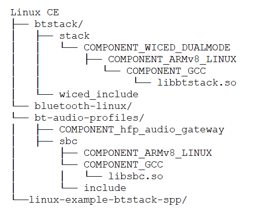

4. Clone the Bluetooth® firmware using following command.
   ```bash
   git clone https://github.com/Infineon/combo-bluetooth-firmware.git
   ```
   User can choose appropriate Bluetooth® firmware for particular AIROC™ Wi-Fi & Bluetooth® combo chip from cloned "combo-bluetooth-firmware" directory.

5. Create the build folder under the code example source folder and build the code example using the following commands:
   ```
   cd $HOME/Linux_CE/linux-example-btstack-spp
   mkdir build && cd build
   cmake -DCMAKE_C_COMPILER:PATH=<GCC_CROSS_COMPILER> ../ && make
   ```
   
   Where,
   - `GCC_CROSS_COMPILER` is the target cross compiler for GCC (generally */usr/bin/aarch64-linux-gnu-gcc* for Arm&reg; 64-based targets)

   The code example executable is generated under the *build* folder with the same name of code example.

   For example, in this project, the "linux-example-btstack-spp" executable is generated at */home/$USER/Linux_CE/linux-example-btstack-spp/build*.
   The prebuild "SERVER" file is Communication Board executable for better visualization and experience that has to be the same place as code example executable. 

## Operation

### Using one hardware platform (Linux host platform and AIROC™ Wi-Fi & Bluetooth® combo chip)

This code example acts as a SPP server.

**Devices used:**

- **Device Under Test (DUT):** One hardware platform (Linux host platform and AIROC™ Wi-Fi & Bluetooth® combo chip) are required that runs the SPP code example.
Role: "SPP Server"

- **Testing Device:** Windows 10 Machine with a terminal emulator application such as Tera Term for creating SPP connection.
Role: "SPP Client"

**Operation procedure:**

1. Copy the code example executable, AIROC™ BTSTACK libraries and Bluetooth® Firmware file from the Linux host PC to the target platform using [SCP](https://help.ubuntu.com/community/SSH/TransferFiles). For example, use the following commands:
   ```
   cd $HOME/Linux_CE/linux-example-btstack-spp/build
   scp linux-example-btstack-spp <TARGET_USER>@<TARGET_IP>:<TARGET_PATH>/.
   cd $HOME/Linux_CE/btstack/stack/COMPONENT_WICED_DUALMODE/COMPONENT_ARMv8_LINUX/COMPONENT_GCC
   scp libbtstack.so <TARGET_USER>@<TARGET_IP>:<TARGET_PATH>/.
   scp <FW_FILE.hcd> <TARGET_USER>@<TARGET_IP>:<TARGET_PATH>/.
   ```
   Copy linux-example-btstack-spp/app/SERVER which is Communication Board to be with code example executable and . [if you are using RPI]
   ```
   scp SERVER <TARGET_USER>@<TARGET_IP>:<TARGET_PATH>/.
   ```
   Where,
   - `TARGET_USER` is user name of the target platform
   - `TARGET_IP` is the IP address of the target platform
   - `TARGET_PATH` is the path of target platform
   - `FW_FILE.hcd` file is the Bluetooth® Firmware file cloned in step-4 of [Using the code example section](#using-the-code-example).

2. Take SSH console of target platform.
   ```bash
   ssh <TARGET_DEVICE_USER_NAME>@<TARGET_DEVICE_IP_ADDRESS>
   ```

3. Add the udev rule in the target host board for HCI UART and GPIO to bypass root access. Use the following steps to create and set up a udev rule.

   **Note:** If you have root access, the following udev rules are not required; you can execute the code example with `sudo` permissions or by switching to the root user.

   1. Create a new *.rules* (for example, *combo-chip-uart-port.rules*) file under */etc/udev/rules.d/* directory for HCI UART. Use the following commands:

      **IMX8Nano:**

      ```bash
      echo "KERNEL==\"ttymxc0\"d,SYMLINK+=\"combo_chip_uart\",MODE=\"0666\"" | sudo tee /etc/udev/rules.d/combo-chip-uart-port.rules
      ```

      **RPICM4:**

      ```bash
      echo "KERNEL==\"ttyAMA0\",SYMLINK+=\"combo_chip_uart\",MODE=\"0666\"" | sudo tee /etc/udev/rules.d/combo-chip-uart-port.rules
      ```

   2. Create new *.rules* (for example, *combo-chip-gpio-port.rules*) for BT_REG_ON GPIO under */etc/udev/rules.d/*. Use the following commands:

      **IMX8Nano & RPICM4:**

      1. Create a rule file using the following command.

         ```bash
         sudo vim /etc/udev/rules.d/combo-chip-gpio-port.rules.rules
         ```

      2. Add the following rules in created files:

         ```bash
         SUBSYSTEM=="gpio*", PROGRAM="/bin/sh -c 'chown -R $user:$group /sys/class/gpio/export /sys/class/gpio/unexport;'"
         SUBSYSTEM=="gpio*", PROGRAM="/bin/sh -c 'chown -R $user:$group /sys%p/direction /sys%p/value; chmod 660 /sys%p/direction /sys%p/value;'"
         ```

   3. Reboot the target device:

      ```bash
      sudo reboot
      ```

       Where,

      - `ttymxc0` and `ttyAMA0` are HCI UART ports for IMX8Nano and RPICM4 respectively
      - `combo_chip_uart` is a friendly name for the HCI UART port
      - `0666` is the permission mask to bypass the root access for HCI UART
   #### Kindly checked before executing (RPI GUI case):

      1. Using default terminal.
         
         which will then be:
         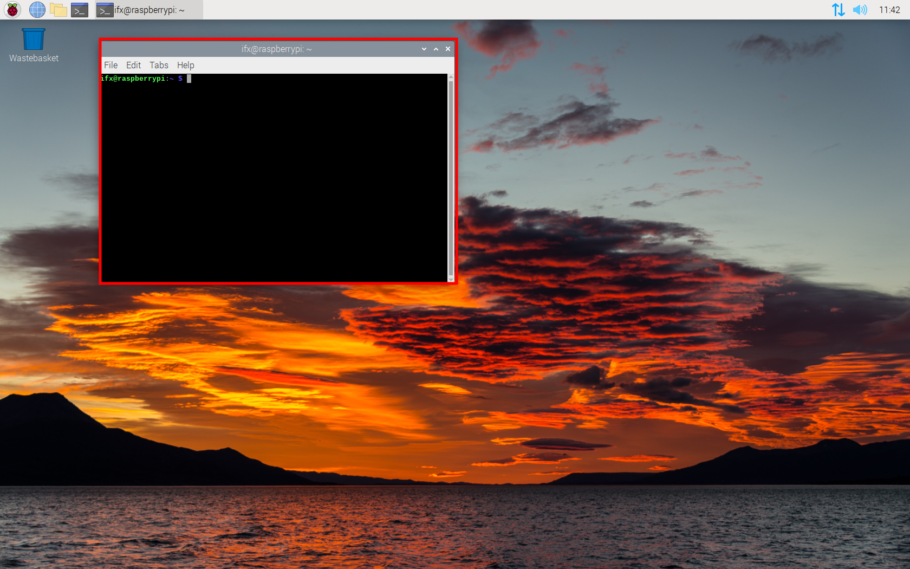
      2. Making sure Communication Board is able to be executed. (file "SERVER")

         For example:\
         Command:
         ```
         ls -al
         ```
         Results:
         ```
         -rwxr-xr-x  1 ifx ifx 14896  八  31 16:02 SERVER
         ```

4. Execute the application by setting the paths of the AIROC™ BTSTACK library using the following command on the target platform.

   ```bash
   cd <TARGET_PATH>
   chmod +x <APP_NAME>
   LD_LIBRARY_PATH=$LD_LIBRARY_PATH:<BTSTACK_LIB_PATH>
   ./<APP_NAME> -c <COM_PORT> -b 3000000 -f 921600 -r <GPIOCHIPx> <REGONPIN> -n -p <FW_FILE_NAME>.hcd -d 112233221133
   ```

   Where,
   - `TARGET_PATH` is the path of the target platform where the code example application copied to
   - `BTSTACK_LIB_PATH` is the path of the AIROC™ BTSTACK library. Skip this if the AIROC™ BTSTACK library and executable are in the same folder
   - `/dev/ttymxc0` is the COM_PORT for IMX8Nano
   - `/dev/ttyAMA0` is the COM_PORT for RPICM4
   - `3000000` is the HCI baud rate
   - `112233221133` is a device BD address
   - `-r <GPIOCHIPx> <REGONPIN> -n`  is setting the GPIO control to enable autobaud for AIROC™ Wi-Fi & Bluetooth® combo chip
      - `-r gpiochip5 0 -n`  For IMX8Nano
      - `-r gpiochip0 3 -n`  For RPICM4
   - `921600` is the firmware download baud rate
   - `.hcd` is the firmware to download (make sure to validate this firmware file path)

   **Note:** Currently, random BD addresses are used for testing.

**Brief Guide**
   - OS with GUI\
      Please follow below flow and refer to steps in corresponding part:
      1. Execute and set code example.
      2. Peer Device Connecting Steps.
      3. After pairing and connecting with peer device
         - **General Usage**
         - **Communication Board**
   - OS **without** GUI\
      Please follow below flow and refer to steps in corresponding part:
      1. Execute and set code example.
      2. Peer Device Connecting Steps.
      3. After pairing and connecting with peer device
         - **General Usage**

      
**SPP Code Example Console Menu**
   - **RPI OS with GUI**
      1. Execute and set code example
         1. Input **Number**. Ports to be created. (You have to remove and pair again if you have changed this settings. Skip it in case everything is the same as last time you paired.)
         2. Input **Communication Board** settings. **Recommand settings on RPI** which allows GUI creates new terminal as Communication Board when thers is a new incoming connection.
         3. After configuration, input **1** to **print menu**, you will see **SERVERs** generated according to your input ports number.
      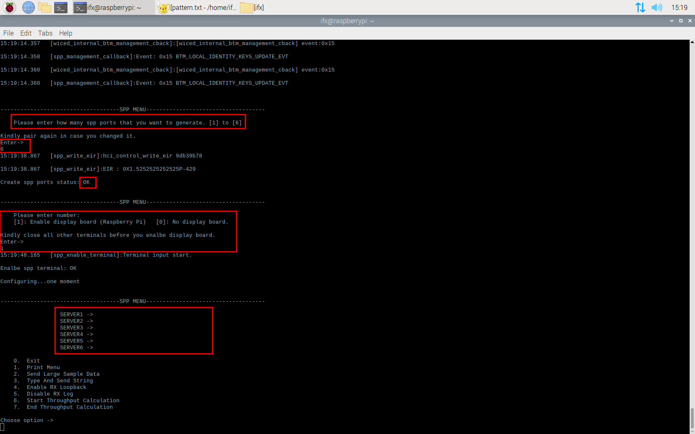

      - **The Communication Board** \
      which establishes bidirectional communication terminal when there is an incoming connection
      you could use it type characters to peer device which might be tera term on windows 10 machine, and here support backspace and directional arrows, in case you want to use other platform (GUI must for Communication board), you only need to change the terminal utility as well as the system call command, then you will be able to see the Communication Board waked up by incoming connection.

      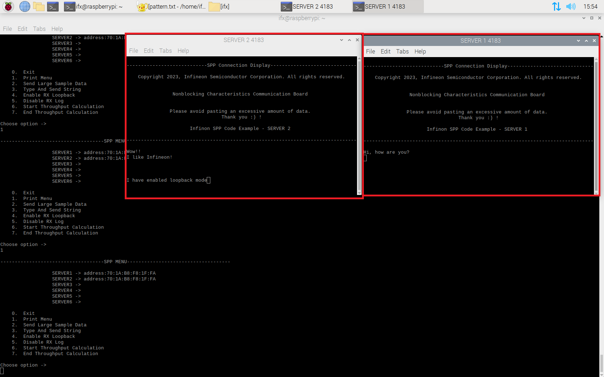

      2. **After** pairing and connecting with peer device (**see peer device first**)
         1. When incoming connection has been established, the correspongding Communication Board will be opened for later communication on both sending and receiving direction.
         2. You are able to check connected ports by print menu again on main console menu.
         3. Peer device's address will be displayed if it is conneted.
         4. Input strings via typing text on corresponding Communication Boards, that will be directlly sent to peer device without buffering.
         5. The same place will display receiving string from peer device. 
         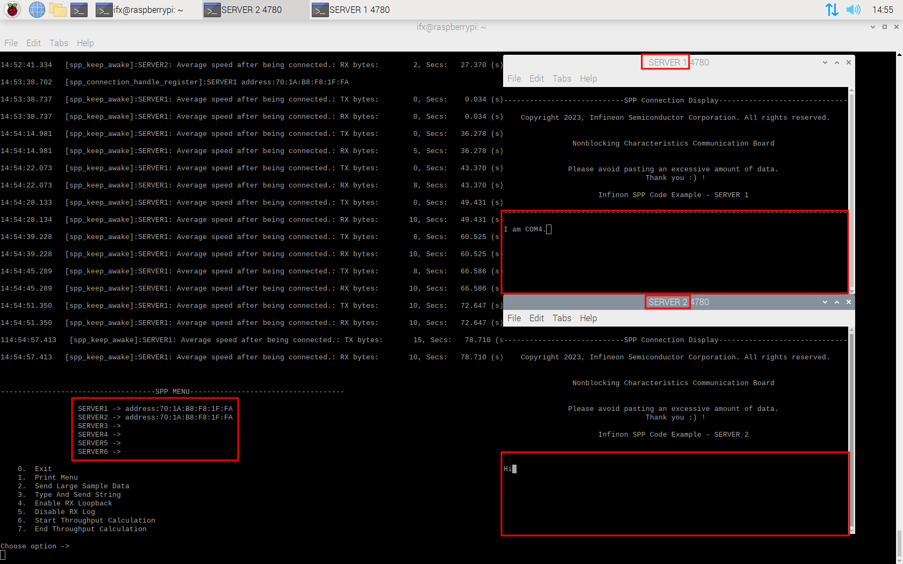
         - **Multi-device and multi-connection**:

            This code example demonstrates the ability of connecting with two devices and up to six spp ports. Given one example following:
         1. Connected by two devices that A device creates three SPP connections, B device creates two. (**Keep in mind, COM ports mapping on different device might be very different.**)\
         SPP menu display each SPP connection and its device address.
         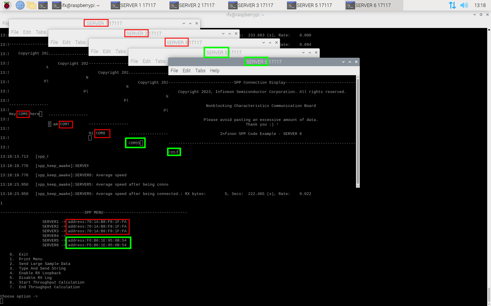
         2. **A device** Bluetooth settings and COM ports detail.
         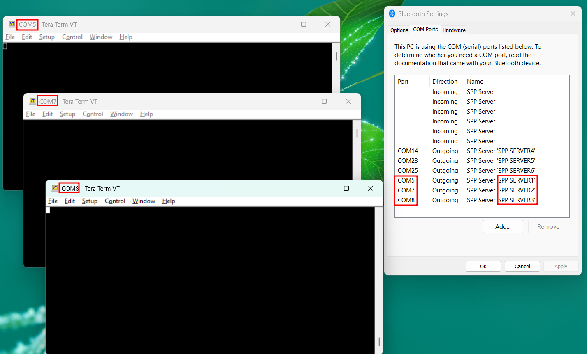
         3. **B device** Bluetooth settings and COM ports detail.
         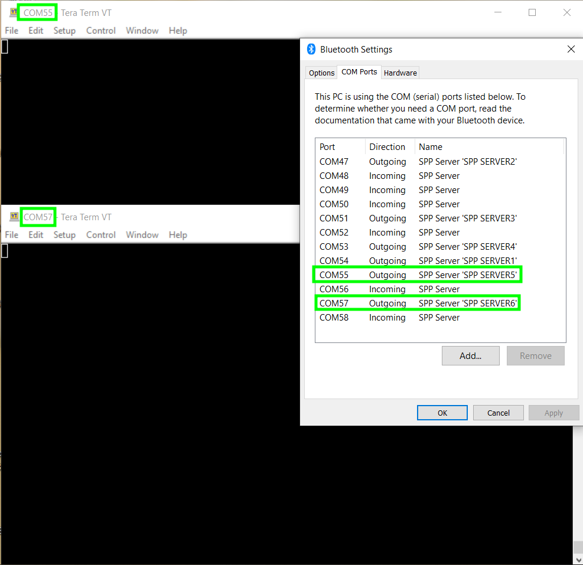
      3. Disconnecting\
         Once disconnection is occured, Communication Board is going to experience closing process.\
         Below pictures showcase SERVER5 has been completely closed and SERVER6 is just disconnected then experiencing closing process.
         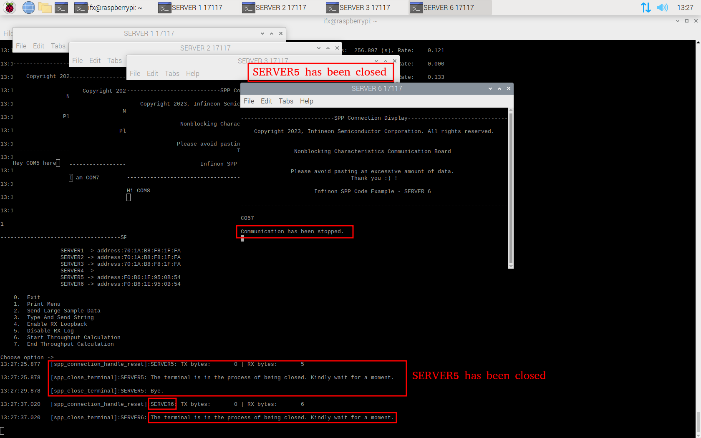

   - **General Usage (Main Console Menu)**

         ---------------------SPP MENU-----------------------

         0.  Exit
         1.  Print Menu
         2.  Send Large Sample Data
         3.  Type And Send String
         4.  Enable RX Loopback
         5.  Disable RX Log
         6.  Start Throughput Calculation
         7.  End Throughput Calculation

      - Option 2: -> choose port (For example: SERVER 1)\
      To send large size data to the SPP client. Repeated continuous numbers from 0 to max payload size will be sent and the corresponding printable ascii characters will be visible on the terminal emulator such as Tera Term of the Windows 10 machine.
      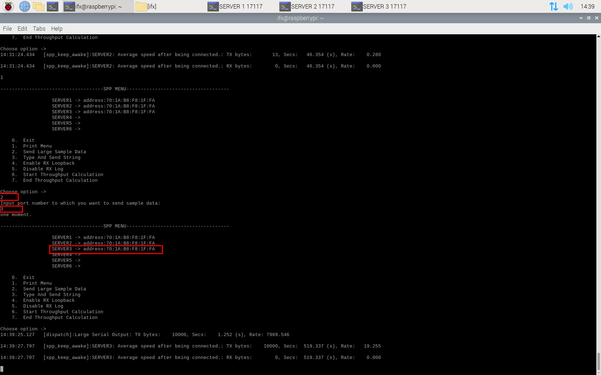 
      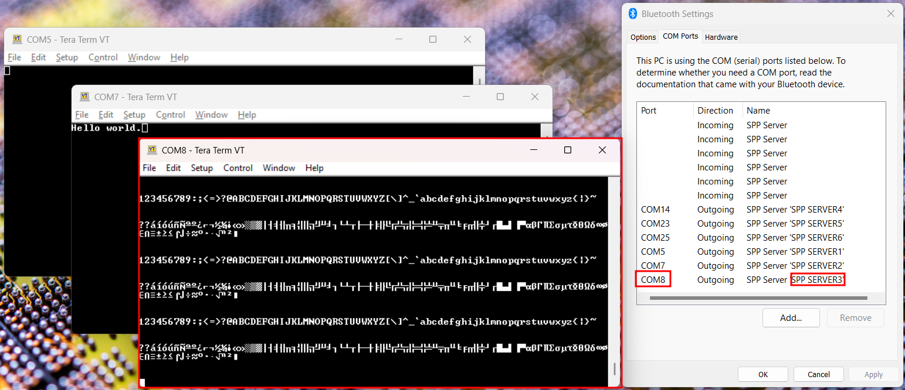   

      - Option 3: -> choose port -> type string\
      To send the user-entered characters to the SPP Client. The same will be visible on the Windows 10 machine's terminal emulator, such as Tera Term.
      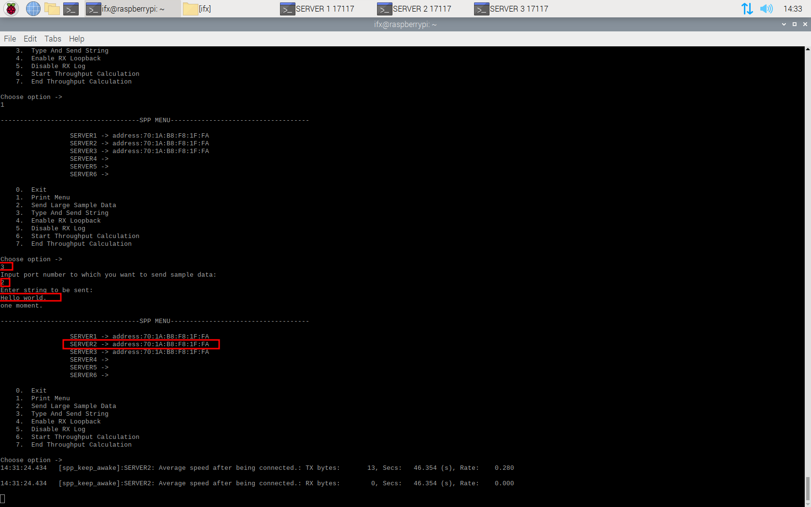 
      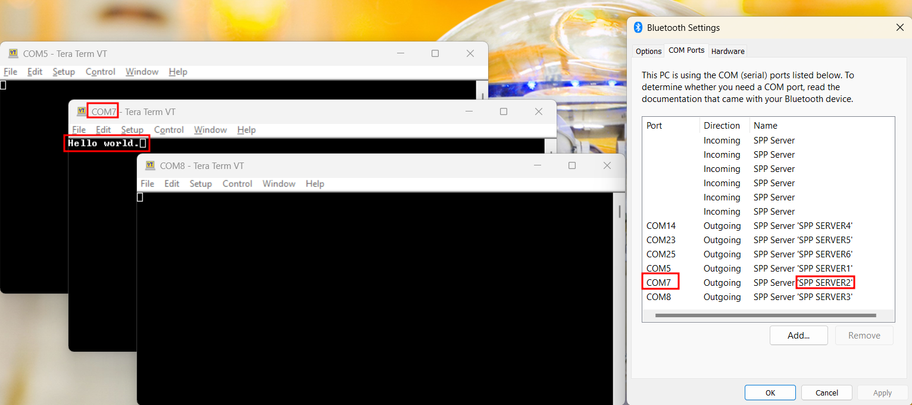

**Peer Device Connecting Steps (Windows 10 or 11)**
1. On Windows 10 PCs, right click on the Bluetooth® icon in the system tray and select 'Show Bluetooth® Devices'. In the Settings menu that opens for 'Bluetooth® & Other Devices', Select 'Add a Bluetooth® Device'. Find and pair with the SPP Server.

6. In the Settings menu that opens for 'Bluetooth® & Other Devices', scroll down and select "More Bluetooth® options" and then select the 'COM Ports' tab. You can see incoming and outgoing COM port on your computer. (According to your SPP code example settings, please remove and pair device once again right after you changed the ports settings.)

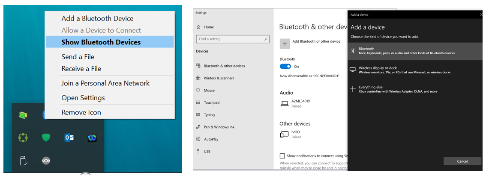
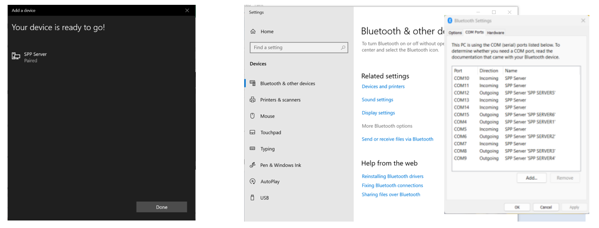

3. Use serial port application such as **Tera Term** to open the outgoing COM port with 115200 baud rate (115200-8-N-1 serial configuration). Opening the port will create the SPP connection.
   1. Bluetooth Settings -> find out an Outgoing port to SPP SERVER ( For example: **COM6** in below pictures). \
   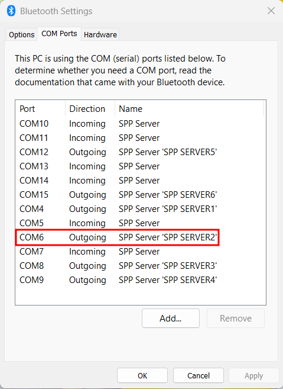
   2. Open Tera Term -> File -> New Connection(Alt + N) -> Serial -> Choose COM port. \
   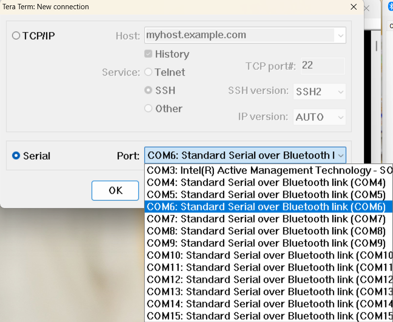

4. Additional Settings
   1. Setup -> Terminal
   Since windows and linux are a little bit different on definition at the end of lines.
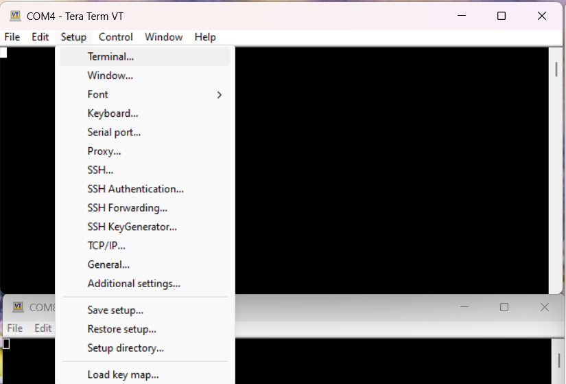
   2. New-line -> Receive: LF -> Transmit: LF\
   Change to LF.\
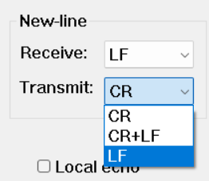

## Debugging

You can debug the example using a generic Linux debugging mechanism such as the following:

1. **Debugging by logging:** Add required prints in the application and check them during execution.

2. **Debugging using GDB:** See the [GDB man page](https://linux.die.net/man/1/gdb) for more details.

## Design and implementation

This code example does the following:

The SPP server CE initializes the stack, opens the RFCOMM channel, and waits for the SPP connection from the client. Once SPP is connected, users can send data to the SPP client via the user menu. Data sent from the SPP client is printed on the SPP Server CE console.

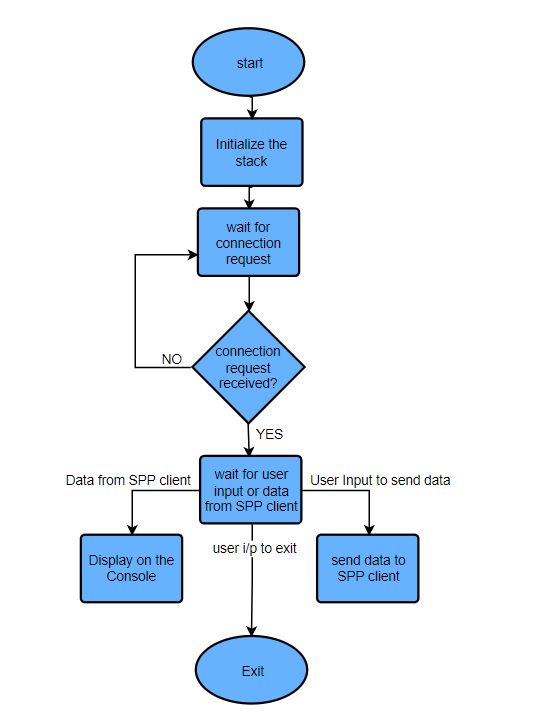

**Note:** Run the application without any arguments to get details of command-line arguments.

## Source file details

 Files   | Description of files
 ------- | ---------------------
 app/main.c  | Implements the main function which takes the user command line inputs.
 app/spp.c  | Implements SPP Server functionalities
 include/spp.h  | Header file for SPP server functionality.
 app_bt_config/wiced_bt_config.c  | This file contains configurations related to BT settings, GAP and HF.

### Resources and settings

**Table 1. Application resources**

 Resource  |  Alias/object     |    Purpose
 :-------- | :-------------    | :------------
 UART |HCI| UART is used for HCI communication with host system

<br>

## Related resources

Resources  | Links
-----------|----------------------------------
Device documentation | [CYW5557x](https://www.infineon.com/cms/en/product/wireless-connectivity/airoc-wi-fi-plus-bluetooth-combos/wi-fi-6-6e-802.11ax/)
AIROC™ BTSTACK library | [AIROC™ BTSTACK library](https://github.com/Infineon/btstack/tree/release-v3.6.0)
Linux porting layer source code | [Linux porting layer source code](https://github.com/Infineon/bluetooth-linux/tree/release-v1.0.0)

## Other resources

Infineon provides a wealth of data at [www.infineon.com](https://www.infineon.com/) to help you select the right device, and quickly and effectively integrate it into your design.

## Document history

Document title: *CE237175* - *AIROC&trade; BTSTACK: Bluetooth&reg; SPP server for Linux host*

 Version | Description of change
 ------- | ---------------------
 1.0.0   | New code example

<br>

---------------------------------------------------------

© Cypress Semiconductor Corporation, 2023. This document is the property of Cypress Semiconductor Corporation, an Infineon Technologies company, and its affiliates ("Cypress").  This document, including any software or firmware included or referenced in this document ("Software"), is owned by Cypress under the intellectual property laws and treaties of the United States and other countries worldwide.  Cypress reserves all rights under such laws and treaties and does not, except as specifically stated in this paragraph, grant any license under its patents, copyrights, trademarks, or other intellectual property rights.  If the Software is not accompanied by a license agreement and you do not otherwise have a written agreement with Cypress governing the use of the Software, then Cypress hereby grants you a personal, non-exclusive, nontransferable license (without the right to sublicense) (1) under its copyright rights in the Software (a) for Software provided in source code form, to modify and reproduce the Software solely for use with Cypress hardware products, only internally within your organization, and (b) to distribute the Software in binary code form externally to end users (either directly or indirectly through resellers and distributors), solely for use on Cypress hardware product units, and (2) under those claims of Cypress’s patents that are infringed by the Software (as provided by Cypress, unmodified) to make, use, distribute, and import the Software solely for use with Cypress hardware products.  Any other use, reproduction, modification, translation, or compilation of the Software is prohibited.
<br>
TO THE EXTENT PERMITTED BY APPLICABLE LAW, CYPRESS MAKES NO WARRANTY OF ANY KIND, EXPRESS OR IMPLIED, WITH REGARD TO THIS DOCUMENT OR ANY SOFTWARE OR ACCOMPANYING HARDWARE, INCLUDING, BUT NOT LIMITED TO, THE IMPLIED WARRANTIES OF MERCHANTABILITY AND FITNESS FOR A PARTICULAR PURPOSE.  No computing device can be absolutely secure.  Therefore, despite security measures implemented in Cypress hardware or software products, Cypress shall have no liability arising out of any security breach, such as unauthorized access to or use of a Cypress product. CYPRESS DOES NOT REPRESENT, WARRANT, OR GUARANTEE THAT CYPRESS PRODUCTS, OR SYSTEMS CREATED USING CYPRESS PRODUCTS, WILL BE FREE FROM CORRUPTION, ATTACK, VIRUSES, INTERFERENCE, HACKING, DATA LOSS OR THEFT, OR OTHER SECURITY INTRUSION (collectively, "Security Breach").  Cypress disclaims any liability relating to any Security Breach, and you shall and hereby do release Cypress from any claim, damage, or other liability arising from any Security Breach.  In addition, the products described in these materials may contain design defects or errors known as errata which may cause the product to deviate from published specifications. To the extent permitted by applicable law, Cypress reserves the right to make changes to this document without further notice. Cypress does not assume any liability arising out of the application or use of any product or circuit described in this document. Any information provided in this document, including any sample design information or programming code, is provided only for reference purposes.  It is the responsibility of the user of this document to properly design, program, and test the functionality and safety of any application made of this information and any resulting product.  "High-Risk Device" means any device or system whose failure could cause personal injury, death, or property damage.  Examples of High-Risk Devices are weapons, nuclear installations, surgical implants, and other medical devices.  "Critical Component" means any component of a High-Risk Device whose failure to perform can be reasonably expected to cause, directly or indirectly, the failure of the High-Risk Device, or to affect its safety or effectiveness.  Cypress is not liable, in whole or in part, and you shall and hereby do release Cypress from any claim, damage, or other liability arising from any use of a Cypress product as a Critical Component in a High-Risk Device. You shall indemnify and hold Cypress, including its affiliates, and its directors, officers, employees, agents, distributors, and assigns harmless from and against all claims, costs, damages, and expenses, arising out of any claim, including claims for product liability, personal injury or death, or property damage arising from any use of a Cypress product as a Critical Component in a High-Risk Device. Cypress products are not intended or authorized for use as a Critical Component in any High-Risk Device except to the limited extent that (i) Cypress’s published data sheet for the product explicitly states Cypress has qualified the product for use in a specific High-Risk Device, or (ii) Cypress has given you advance written authorization to use the product as a Critical Component in the specific High-Risk Device and you have signed a separate indemnification agreement.
<br>
Cypress, the Cypress logo, and combinations thereof, WICED, ModusToolbox, PSoC, CapSense, EZ-USB, F-RAM, and Traveo are trademarks or registered trademarks of Cypress or a subsidiary of Cypress in the United States or in other countries. For a more complete list of Cypress trademarks, visit www.infineon.com. Other names and brands may be claimed as property of their respective owners.
