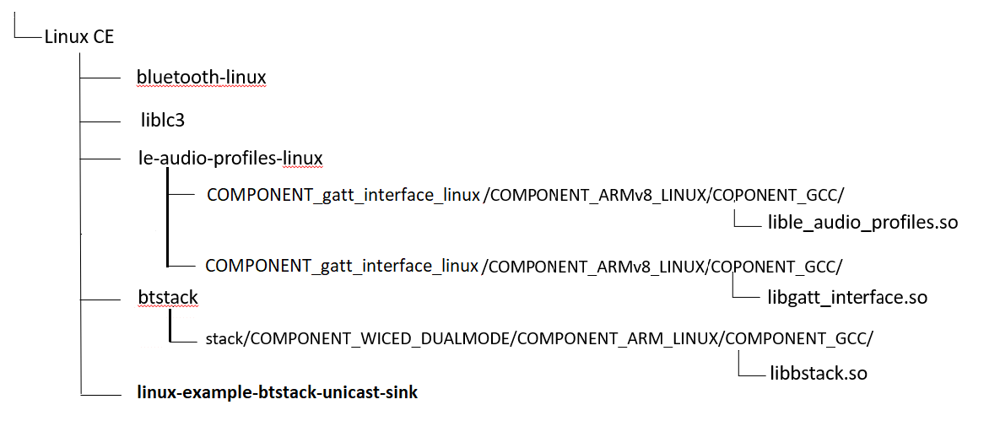

# AIROC™ BTSTACK: Bluetooth® LE-Audio: Unicast Sink for Linux host

This code example demonstrates Bluetooth&reg; LE Audio Unicast Sink functionality using AIROC™ Wi-Fi & Bluetooth® combo chip.

This app demonstrates Bluetooth® LE Unicast Sink.

The function includes:
* Unicast sink start/stop ADV. 
* Unicast sink connect to source 1 connection. 1 CIG. 1 CIS.
* Unicast audio stream configuration.
* Unicast audio stream establishment
* Compatible with Google LC3 codec.

[View this README on GitHub.](https://github.com/Infineon/linux-example-btstack-unicast-sink)

[Provide feedback on this code example.](replace_code_example_voc_survey_url)

## Requirements

- Programming language: C
- Embedded Linux Host platforms (Arm® Cortex®-A Class processors). Supported Embedded Linux host platforms:
   1. RPICM4-lite with custom HW base board from Infineon
   2. [IMX8 nano uCOM board](https://www.embeddedartists.com/products/imx8m-nano-developers-kit-v3/) from Embedded Artists
- AIROC™ BTSTACK library and Linux porting layer source code
- AIROC™ Wi-Fi & Bluetooth® combo chip Bluetooth® Firmware file (.hcd).
- Linux Host PC with Ubuntu 20.04


## Supported toolchains (make variable 'TOOLCHAIN')

- GNU Arm® GCC Arch64 v9.3.0 (`GCC_ARM`)

## Supported AIROC™ Wi-Fi & Bluetooth® combo chip

- [AIROC™ CYW5557x Wi-Fi & Bluetooth® combo chip](https://www.infineon.com/cms/en/product/wireless-connectivity/airoc-wi-fi-plus-bluetooth-combos/wi-fi-6-6e-802.11ax/)

## Hardware setup

Set up the hardware according to **Figure 1**:

**Figure 1. Block diagram: Hardware setup**


## Software setup

Set up a cross compiler according to the target platform along with CMake on the Linux host PC based on Ubuntu 20.04.1.

1. Open a terminal on the Linux host PC.

2. Use the following command to install the cross compiler, build tools, and dependencies:
   ```bash
   sudo apt-get install git cmake gcc-aarch64-linux-gnu build-essential -y
   ```

## Using the code example

Do the following on the Linux host PC to compile the code example:

1. Create a directory under `$HOME` on the Linux host PC and switch to the created directory. For example, use the following commands to switch:
   ```bash
   mkdir $HOME/Linux_CE
   cd $HOME/Linux_CE
   ```

2. Fetch the code example source code from GitHub.
   ```bash
   git clone https://gitlab.intra.infineon.com/tbst/linux_bt_ce/le-audio/linux-example-btstack-unicast-sink.git

   ```

3. Clone the code example dependencies (BTSTACK library and Linux porting layer source code) using the following commands:
   ```bash
   git clone https://github.com/Infineon/btstack.git --branch release-v3.7.1
   git clone https://gitlab.intra.infineon.com/repo-staging/bluetooth-linux.git --branch Hedorah-TC2
   git clone https://gitlab.intra.infineon.com/repo-staging/le-audio-profiles-linux.git --branch 1.0.1.3790
   git clone https://github.com/google/liblc3 --branch v1.0.3
   ```

   Three different directories are created after cloning the code example and its dependencies as shown in the **Figure 2**.

   **Figure 2. Code example directory structure**

   

4. Clone the Bluetooth® firmware using following command.
   [AIROC™ CYW5557x Wi-Fi & Bluetooth® combo chip]
   ```bash
   git clone https://github.com/Infineon/combo-bluetooth-firmware.git
   ```
   User can choose appropriate Bluetooth® firmware for particular AIROC™ Wi-Fi & Bluetooth® combo chip from cloned "combo-bluetooth-firmware" directory.
5. Create the build folder under the code example source folder and build the code example using the following commands:

   ```
   build google lc3 library first
   cd $HOME/Linux_CE/linux-example-btstack-unicast-sink/COMPONENT_LC3_CODEC/google_lc3
   ./build_google_lc3.sh
   ```

   ```
   cd $HOME/Linux_CE/linux-example-btstack-unicast-sink
   mkdir build && cd build
   cmake -DCMAKE_C_COMPILER:PATH=<GCC_CROSS_COMPILER> ../ && make
   ```
   Where,
   - `GCC_CROSS_COMPILER` is the target cross compiler for GCC (generally */usr/bin/aarch64-linux-gnu-gcc* for ARM64-based targets)

   The code example executable is generated under the *build* folder with the same name of code example.

   For example, in this project, the "linux-example-btstack-unicast-sink" executable is generated at */home/$USER/Linux_CE/linux-example-btstack-unicast-sink/build*.

## Features demonstrated
- AIROC BTSTACK configuration initialization
- HARDWARE platform configuration
- Download Controller Firmware
* Unicast sink side control stream PLAY/PAUSE. 
* Unicast sink side control volume UP/DOWN. 
* Unicast sink side set volume absolute value. 
* Unicast sink side control MUTE/UNMUTE.
* Unicast source support samples.
  - 8k  
  - 16k 
  - 24k 
  - 32k 
  - 48k
* Unicast source support QoS Configuration.
  - 8_2_1
  - 16_2_1
  - 24_2_1
  - 32_2_1
  - 48_2_1


## Operation

This code example acts as LE Audio Unicast sink. Should use the Unicast source code example to interaction test.

Two devices are required to demonstrate this application:
One hardware platform (Linux host platform + AIROC™ Wi-Fi &  combo chip, i.e., the device running the Unicast Sink application).

1. Take SSH console of target platform.
   ```bash
   ssh <TARGET_DEVICE_USER_NAME>@<TARGET_DEVICE_IP_ADDRESS>
   ```

2. Copy the code example executable and AIROC™ BTSTACK library from the Linux host PC to the target platform using [SCP](https://help.ubuntu.com/community/SSH/TransferFiles). For example, use the following commands:
   ```
   cd $HOME/Linux_CE/linux-example-btstack-unicast-sink/build
   scp linux-example-btstack-unicast-sink <TARGET_USER>@<TARGET_IP>:<TARGET_PATH>/.

   cd $HOME/Linux_CE/btstack/stack/COMPONENT_WICED_DUALMODE/COMPONENT_ARMv8_LINUX/COMPONENT_GCC
   scp libbtstack.so <TARGET_USER>@<TARGET_IP>:<TARGET_PATH>/.

   cd $HOME/Linux_CE/le-audio-profiles-linux/COMPONENT_le_audio_profiles_linux/COMPONENT_ARMv8_LINUX/COMPONENT_GCC
   scp lible_audio_profiles.so <TARGET_USER>@<TARGET_IP>:<TARGET_PATH>/.

   cd $HOME/Linux_CE/le-audio-profiles-linux/COMPONENT_gatt_interface_linux/COMPONENT_ARMv8_LINUX/COMPONENT_GCC
   scp libgatt_interface.so <TARGET_USER>@<TARGET_IP>:<TARGET_PATH>/.

   scp <FW_FILE.hcd> <TARGET_USER>@<TARGET_IP>:<TARGET_PATH>/.
   ```
   Where,
   - `TARGET_USER` is the user name of the target platform
   - `TARGET_IP` is an IP address of the target platform
   - `TARGET_PATH` is the path of target platform
   - `FW_FILE.hcd` file is Bluetooth® Firmware file cloned in [Using the code example section](#using-the-code-example).


3. Add the udev rule in the target host board for HCI UART and GPIO to bypass root access. Use the following steps to create and set up a udev rule.

   **Note:** If you have root access, the following udev rules are not required; you can execute the code example with `sudo` permissions or by switching to the root user.

   1. Create a new *.rules* (for example, *combo-chip-uart-port.rules*) file under */etc/udev/rules.d/* directory for HCI UART. Use the following commands:

      **IMX8Nano:**

      ```bash
      echo "KERNEL==\"ttymxc0\"d,SYMLINK+=\"combo_chip_uart\",MODE=\"0666\"" | sudo tee /etc/udev/rules.d/combo-chip-uart-port.rules
      ```

      **RPICM4:**

      ```bash
      echo "KERNEL==\"ttyAMA0\",SYMLINK+=\"combo_chip_uart\",MODE=\"0666\"" | sudo tee /etc/udev/rules.d/combo-chip-uart-port.rules
      ```


   2. Create new *.rules* (for example, *combo-chip-gpio-port.rules*) for BT_REG_ON GPIO under */etc/udev/rules.d/*. Use the following commands:

      **IMX8Nano & RPICM4:**

      1. Create a rule file using the following command.

         ```bash
         sudo vim /etc/udev/rules.d/combo-chip-gpio-port.rules.rules
         ```

      2. Add the following rules in created files:

         ```bash
         SUBSYSTEM=="gpio*", PROGRAM="/bin/sh -c 'chown -R $user:$group /sys/class/gpio/export /sys/class/gpio/unexport;'"
         SUBSYSTEM=="gpio*", PROGRAM="/bin/sh -c 'chown -R $user:$group /sys%p/direction /sys%p/value; chmod 660 /sys%p/direction /sys%p/value;'"
         ```

   3. Create a new file .asoundrc (IMX8 only) and add the following in created files:

      **IMX8Nano:**
      put .asoundrc in /home/root/

      ```bash
        pcm.!default {
            type plug
            slave {
                pcm "hw:0,0"
            }
        }
      ```


   4. Reboot the target device:

      ```bash
      sudo reboot
      ```

       Where,

      - `ttymxc0`, and `ttyAMA0` are HCI UART ports for IMX8Nano and RPICM4 respectively
      - `combo_chip_uart` is a friendly name for the HCI UART port
      - `0666` is the permission mask to bypass the root access for HCI UART

4. Execute the application by setting the paths of the AIROC™ BTSTACK library using the following command on the target platform:
   ```
   cd <TARGET_PATH>
   chmod +x <APP_NAME>
   LD_LIBRARY_PATH=$LD_LIBRARY_PATH:<BTSTACK_LIB_PATH>
   ./<APP_NAME> -c <COM_PORT> -b 3000000 -f 921600 -r <GPIOCHIPx> <REGONPIN> -n -p <FW_FILE_NAME>.hcd -d 112233221144
   ```
   Where,
   - `TARGET_PATH` is the path of the target platform where the code example application copied to
   - `BTSTACK_LIB_PATH` is the path of the AIROC™ BTSTACK library. Skip this if the AIROC™ BTSTACK library and code example application executable are in the same folder
   - `/dev/ttymxc0` is the COM_PORT for IMX8Nano
   - `/dev/ttyAMA0` is the COM_PORT for RPICM4
   - `3000000` is the HCI baud rate
   - `112233221133` is a device BD address
   - `-r <GPIOCHIPx> <REGONPIN> -n`  is setting the GPIO control to program the Bluetooth® Firmware for AIROC™ Wi-Fi + Bluetooth® combo chip
      - `-r gpiochip5 0 -n`  For IMX8Nano
      - `-r gpiochip0 3 -n`  For RPICM4
   - `921600` is the firmware patch download baud rate
   - `.hcd` is the firmware patch to download (make sure to validate this firmware patch file path)
     **Note 1:** If you haven't set up a udev rule mentioned in Step 4, execute the command with `sudo` permissions.

5. When the code example is launched

   Wait for the download hcd file message from the console.
   ```
   ...
   Download pathfile <FW-FILE-NAME>.hcd
   ...
   patch_download_complete
   ...
   Patch successfully downloaded. Reset chip
   ```

   Press enter key, a hint appears on the terminal as follows:
```bash
    Press 1 and Click Enter to Show Menu Option!!
```
   Press 1 key and press enter, menu appears on the terminal as follows:
```bash
---------------------------------------------------
    0.	Exit
    1.	Print Menu
    2.	Read Local BD address
    3.	SHOW SINK CURRENT STATUS
    4.	START ADV
    5.	STOP  ADV
    6.	SELECT CONNECTED DEVICE
    7.	PLAY
    8.	PAUSE
    9.	VOL UP
    10.	VOL DOWN
    11.	MUTE
    12.	UNMUTE
    13.	SET ABS VOL
---------------------------------------------------
```

- Quick start guide
```bash
    step 1: Unicast-sink start ADV
    step 2: wait source connect
    step 3: select the connected source device.
    step 4: volume control
    step 5: pause audio stream
    step 6: play audio stream
```

- Unicast sink start ext ADV with WICED_BT_UUID_AUDIO_STREAM_CONTROL
```bash
    [unicast_sink_handle_adv] adv 1 len 1
```

- Check Current status of source device
```bash
---------------------------------------------------
    ADV Status:Start
    [unicast_sink_show_connected_device]:Connected Remote BD ADDR:xx-xx-xx-xx-xx-xx~    Handle:0
    No Selected Connected Source
---------------------------------------------------
```

- Select the connected sink device.
```bash
    Input the Handle of Connected Source Device
    [unicast_sink_show_connected_device]:Connected Remote BD ADDR:xx-xx-xx-xx-xx-xx~    Handle:0
```
 

## Debugging

You can debug the example using the following generic Linux debugging mechanism:

- **Debugging by logging:** You can add prints in the application and check it during execution.

- **Debugging using GDB:** See [GDB man page](https://linux.die.net/man/1/gdb) for more details.

## Design and implementation

This code example does the following:

1. Parses the command-line arguments.

2. Initializes the AIROC™ BTSTACK library for the Airoc Combo Chip.

### Resources and settings

**Table 1. Application resources**

 Resource  |  Alias/object     |    Purpose
 :-------- | :-------------    | :------------
 UART |HCI| UART is used for HCI communication with host system

<br />

## Related resources

Resources  | Links
-----------|----------------------------------
Device documentation | [AIROC™ CYW5557x Wi-Fi 6E tri-band Wi-Fi and Bluetooth® 5.2 SoC](https://www.infineon.com/cms/en/product/wireless-connectivity/airoc-wi-fi-plus-bluetooth-combos/cyw5557x/)
AIROC™ BTSTACK library | [AIROC™ BTSTACK library](https://github.com/Infineon/btstack/tree/release-v3.7.1)
Linux porting layer source code | [Linux porting layer source code](https://github.com/Infineon/bluetooth-linux)


## Other resources


Infineon provides a wealth of data at [www.infineon.com](https://www.infineon.com/) to help you select the right device, and quickly and effectively integrate it into your design.

## Document history

Document title: *CE* – *AIROC&trade; Airoc Combo Chip: Bluetooth&reg;*

 Version | Description of change
 ------- | ---------------------
 1.0.0   | New code example


---------------------------------------------------------

© Cypress Semiconductor Corporation, 2022. This document is the property of Cypress Semiconductor Corporation, an Infineon Technologies company, and its affiliates ("Cypress").  This document, including any software or firmware included or referenced in this document ("Software"), is owned by Cypress under the intellectual property laws and treaties of the United States and other countries worldwide.  Cypress reserves all rights under such laws and treaties and does not, except as specifically stated in this paragraph, grant any license under its patents, copyrights, trademarks, or other intellectual property rights.  If the Software is not accompanied by a license agreement and you do not otherwise have a written agreement with Cypress governing the use of the Software, then Cypress hereby grants you a personal, non-exclusive, nontransferable license (without the right to sublicense) (1) under its copyright rights in the Software (a) for Software provided in source code form, to modify and reproduce the Software solely for use with Cypress hardware products, only internally within your organization, and (b) to distribute the Software in binary code form externally to end users (either directly or indirectly through resellers and distributors), solely for use on Cypress hardware product units, and (2) under those claims of Cypress’s patents that are infringed by the Software (as provided by Cypress, unmodified) to make, use, distribute, and import the Software solely for use with Cypress hardware products.  Any other use, reproduction, modification, translation, or compilation of the Software is prohibited.
<br />
TO THE EXTENT PERMITTED BY APPLICABLE LAW, CYPRESS MAKES NO WARRANTY OF ANY KIND, EXPRESS OR IMPLIED, WITH REGARD TO THIS DOCUMENT OR ANY SOFTWARE OR ACCOMPANYING HARDWARE, INCLUDING, BUT NOT LIMITED TO, THE IMPLIED WARRANTIES OF MERCHANTABILITY AND FITNESS FOR A PARTICULAR PURPOSE.  No computing device can be absolutely secure.  Therefore, despite security measures implemented in Cypress hardware or software products, Cypress shall have no liability arising out of any security breach, such as unauthorized access to or use of a Cypress product. CYPRESS DOES NOT REPRESENT, WARRANT, OR GUARANTEE THAT CYPRESS PRODUCTS, OR SYSTEMS CREATED USING CYPRESS PRODUCTS, WILL BE FREE FROM CORRUPTION, ATTACK, VIRUSES, INTERFERENCE, HACKING, DATA LOSS OR THEFT, OR OTHER SECURITY INTRUSION (collectively, "Security Breach").  Cypress disclaims any liability relating to any Security Breach, and you shall and hereby do release Cypress from any claim, damage, or other liability arising from any Security Breach.  In addition, the products described in these materials may contain design defects or errors known as errata which may cause the product to deviate from published specifications. To the extent permitted by applicable law, Cypress reserves the right to make changes to this document without further notice. Cypress does not assume any liability arising out of the application or use of any product or circuit described in this document. Any information provided in this document, including any sample design information or programming code, is provided only for reference purposes.  It is the responsibility of the user of this document to properly design, program, and test the functionality and safety of any application made of this information and any resulting product.  "High-Risk Device" means any device or system whose failure could cause personal injury, death, or property damage.  Examples of High-Risk Devices are weapons, nuclear installations, surgical implants, and other medical devices.  "Critical Component" means any component of a High-Risk Device whose failure to perform can be reasonably expected to cause, directly or indirectly, the failure of the High-Risk Device, or to affect its safety or effectiveness.  Cypress is not liable, in whole or in part, and you shall and hereby do release Cypress from any claim, damage, or other liability arising from any use of a Cypress product as a Critical Component in a High-Risk Device. You shall indemnify and hold Cypress, including its affiliates, and its directors, officers, employees, agents, distributors, and assigns harmless from and against all claims, costs, damages, and expenses, arising out of any claim, including claims for product liability, personal injury or death, or property damage arising from any use of a Cypress product as a Critical Component in a High-Risk Device. Cypress products are not intended or authorized for use as a Critical Component in any High-Risk Device except to the limited extent that (i) Cypress’s published data sheet for the product explicitly states Cypress has qualified the product for use in a specific High-Risk Device, or (ii) Cypress has given you advance written authorization to use the product as a Critical Component in the specific High-Risk Device and you have signed a separate indemnification agreement.
<br />
Cypress, the Cypress logo, and combinations thereof, WICED, ModusToolbox, PSoC, CapSense, EZ-USB, F-RAM, and Traveo are trademarks or registered trademarks of Cypress or a subsidiary of Cypress in the United States or in other countries. For a more complete list of Cypress trademarks, visit cypress.com. Other names and brands may be claimed as property of their respective owners.
