# AIROC™ BTSTACK: Bluetooth® Wi-Fi Onboarding for Linux host

This code example demonstrates the Bluetooth® Wi-Fi Onboarding using the AIROC™ Wi-Fi & Bluetooth® combo chip with Arm® Cortex®-A Class processors.

[View this README on GitHub.](https://github.com/Infineon/linux-example-btstack-wifi-onboarding)

[Provide feedback on this code example.](replace_code_example_voc_survey_url)

# Requirements

- Programming language: C
- Embedded Linux Host platforms (Arm® Cortex®-A Class processors). Supported Embedded Linux host platforms:
   1. RPI CM4-lite with custom HW base board from Infineon
   2. [IMX8 nano uCOM board](https://www.embeddedartists.com/products/imx8m-nano-developers-kit-v3/) from Embedded Artists
- AIROC™ BTSTACK library and Linux porting layer source code
- AIROC™ Wi-Fi & Bluetooth® combo chip Bluetooth® Firmware file (.hcd).
- Linux Host PC with Ubuntu 20.04


## Supported toolchains (make variable 'TOOLCHAIN')

- GNU Arm® GCC AArch64 v9.3.0 (`GCC_ARM`)

## Supported AIROC™ Wi-Fi & Bluetooth® combo chip

- [AIROC™ CYW5557x Wi-Fi & Bluetooth® combo chip](https://www.infineon.com/cms/en/product/wireless-connectivity/airoc-wi-fi-plus-bluetooth-combos/wi-fi-6-6e-802.11ax/)
- [AIROC™ CYW54591 Wi-Fi & Bluetooth® combo chip](https://www.infineon.com/cms/en/product/wireless-connectivity/airoc-wi-fi-plus-bluetooth-combos/wi-fi-5-802.11ac/cyw54591/)
- [AIROC™ CYW43439 Wi-Fi & Bluetooth® combo chip](https://www.infineon.com/cms/en/product/wireless-connectivity/airoc-wi-fi-plus-bluetooth-combos/wi-fi-4-802.11n/cyw43439/)
- [AIROC™ CYW43012 Wi-Fi & Bluetooth® combo chip](https://www.infineon.com/cms/en/product/wireless-connectivity/airoc-wi-fi-plus-bluetooth-combos/wi-fi-4-802.11n/cyw43012/)

## Hardware setup

Set up the hardware according to the following diagram:

**Figure 1. Block diagram: Hardware setup**


## Software setup

Set up a cross compiler according to the target platform along with CMake on the Linux host PC based on Ubuntu 20.04.

<mark>*These steps are for arm64 based target platform. Please review these steps before adding support for any other target*

1. Open a terminal on the Ubuntu Linux host PC.

2. Use the following command to install the cross compiler, build tools, and dependencies:

   ```bash
   sudo apt-get install git cmake gcc-aarch64-linux-gnu build-essential -y
   ```

3. For the Bluetooth&reg; LE GATT Client, download and install **nRF Connect** on mobile phone using the following:
   - https://apps.apple.com/tw/app/nrf-connect-for-mobile/id1054362403
   - https://play.google.com/store/apps/details?id=no.nordicsemi.android.mcp&hl=zh_TW&gl=US.
      
   **Or**

   - Scan the following QR codes from your mobile phone to download the app. 

   **Figure 2. Application QR code**

   - App store [iOS]:

   

   - Play store [Android]:

   

   ## Additional settings on Android
   - Enlarge MTU size for receiving data with bigger size. eg: Notification status: "Connected:\<ip address>"
   
      1. Open the menu on the top left corner.

         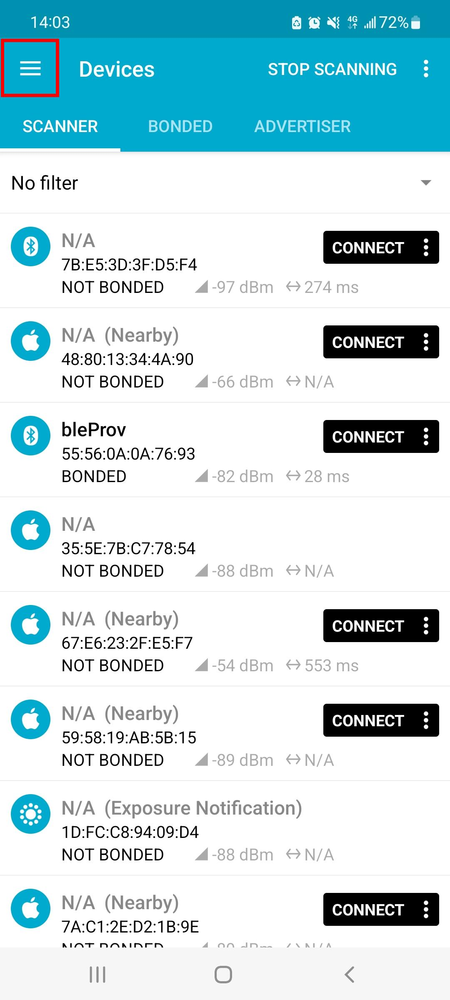 

      2. Press "Settings".

         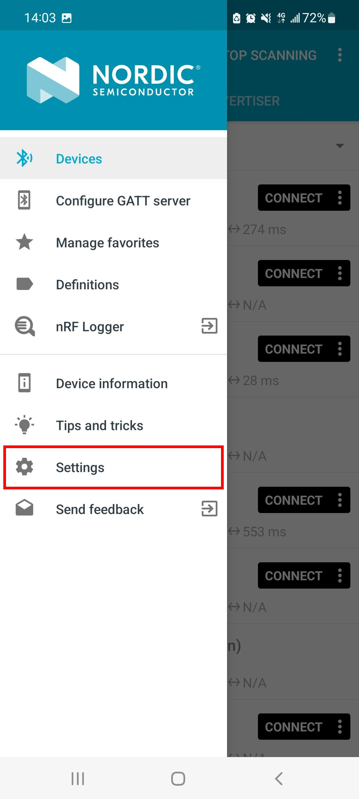 

      3. Press "Connectivity".

         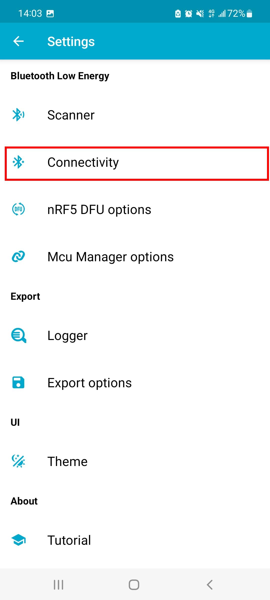 

      4. Enable "Auto request maximum MTU".

         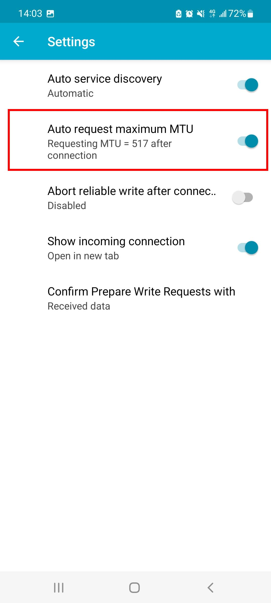 
         
      5. Now you should be able to receive longer data such as ip address etc.

## Using the code example

Do the following on the Linux host PC to compile the code example:

1. Create a directory under `$HOME` on the Linux host PC and switch to the created directory. Use the following commands, for example:
   ```bash
   mkdir $HOME/Linux_CE
   cd $HOME/Linux_CE
   ```
   **Note:** Replace *Linux_CE* with a directory of your choice.

2. Fetch the code example source code using the following command:
   ```bash
   git clone https://github.com/Infineon/linux-example-btstack-wifi-onboarding.git
   ```

3. Clone the code example dependencies (BTSTACK library and Linux porting layer source code) using the following commands:
   ```bash
   git clone https://github.com/Infineon/btstack.git -b release-v3.6.1
   git clone https://github.com/Infineon/bluetooth-linux.git -b release-v2.0.0
   ```

   Three different directories are created after cloning the code example and its dependencies - see the following example:

   **Figure 2. Code example directory structure**

   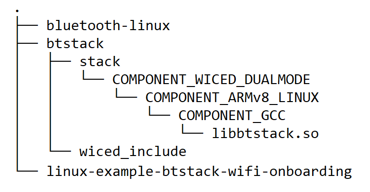

4. Clone the Bluetooth® firmware using following command.
   ```bash
   git clone https://github.com/Infineon/combo-bluetooth-firmware.git
   ```
   User can choose appropriate Bluetooth® firmware for particular AIROC™ Wi-Fi & Bluetooth® combo chip from cloned "combo-bluetooth-firmware" directory.

5. Create the build folder under the code example source folder and build the code example using the following commands:
   ```
   cd $HOME/Linux_CE/linux-example-btstack-wifi-onboarding
   mkdir build && cd build
   cmake -DCMAKE_C_COMPILER:PATH=<GCC_CROSS_COMPILER> ../ && make
   ```
   Where,
   - `GCC_CROSS_COMPILER` is the target cross compiler for GCC (generally */usr/bin/aarch64-linux-gnu-gcc* for ARM64-based targets)

   The code example executable is generated under the *build* folder with the same name of code example.

   For example, in this project, the "linux-example-btstack-wifi-onboarding" executable is generated at */home/$USER/Linux_CE/linux-example-btstack-wifi-onboarding/build*.

# Operation

### Devices used

- **Device under test (DUT):** Embedded Linux host platforms with AIROC™ Wi-Fi & Bluetooth® Combo Chip (target platform) that runs the Wifi Onboarding application. It implements GATT Server, and GAP Peripheral role

- **Testing device:** Mobile (Android) with nRF Connect application. Used as "Wifi Setting sender", GATT Client, and GAP Central role.

### Operation procedure

1. Copy the code example executable and AIROC™ BTSTACK library from the Linux host PC to the target platform. For an example, use the following commands [SCP](https://help.ubuntu.com/community/SSH/TransferFiles):
   ```bash
   cd $HOME/Linux_CE/linux-example-btstack-wifi-onboarding/build
   scp linux-example-btstack-wifi-onboarding <TARGET_USER>@<TARGET_IP>:<TARGET_PATH>/.
   cd $HOME/Linux_CE/linuxbt/btstack/stack/COMPONENT_WICED_DUALMODE/COMPONENT_ARMv8_LINUX/COMPONENT_GCC
   scp libbtstack.so <TARGET_USER>@<TARGET_IP>:<TARGET_PATH>/.
   scp <FW_FILE.hcd> <TARGET_USER>@<TARGET_IP>:<TARGET_PATH>/.
   ```
   Where,
   - `TARGET_USER` is the user name of the target platform.
   - `TARGET_IP` is the IP address of the target platform.
   - `TARGET_PATH` is the path of the target platform.
   - `FW_FILE.hcd` file is Bluetooth® Firmware file cloned in step-4 of [Using the code example section](#using-the-code-example).

2. Take SSH console of target platform.
   ```bash
   ssh <TARGET_DEVICE_USER_NAME>@<TARGET_DEVICE_IP_ADDRESS>
   ```

3. Copy scripts under */linux-example-btstack-wifi-onboarding/Wi-Fi_interface_<TARGET_PLATFORM>*.
   ```bash
   cd $HOME/Linux_CE/linux-example-btstack-wifi-onboarding/
   scp Wi-Fi_interface_<TARGET_PLATFORM>/* <TARGET_USER>@<TARGET_IP>:<TARGET_PATH>/
   ```
   Where,
   - `TARGET_PLATFORM` is "RPI" for RPICM4 and "iMX8" for iMX8Nano
   - `TARGET_USER` is the user name of the target platform.
   - `TARGET_IP` is the IP address of the target platform.
   - `TARGET_PATH` is the path of the target platform.

4. [optional] Load Wi-Fi driver on target platform, the same steps as bringing up Infineon Wi-Fi functionality. Kindly load drivers each time after you boot up your system if you followed our bring up example.
**These steps are only for making sure your Wi-Fi is available on your target platform, you can have your own Wi-Fi setup and skip these steps.**
   ```bash
   sudo rmmod brcmfmac brcmutil cfg80211 compat
   sudo insmod /WIFI_DRIVER_PATH/compat.ko
   sudo insmod /WIFI_DRIVER_PATH/cfg80211.ko
   sudo insmod /WIFI_DRIVER_PATH/brcmutil.ko
   sudo insmod /WIFI_DRIVER_PATH/brcmfmac.ko
   ```
   Where,
   - `<WIFI_DRIVER_PATH>` is the path to your Wi-Fi driver

5. Add the udev rule in the target board for HCI UART and GPIO to bypass root access. Use the following steps to create and set up a udev rule:

   **Note:** If you have root access, the following udev rules are not required; you can execute the code example with `sudo` permissions or by switching to the root user.

   1. Create a new *.rules* (for example, *combo-chip-uart-port.rules*) file under */etc/udev/rules.d/* directory for HCI UART. Use the following commands:

      **IMX8Nano:**

      ```bash
      echo "KERNEL==\"ttymxc0\"d,SYMLINK+=\"combo_chip_uart\",MODE=\"0666\"" | sudo tee /etc/udev/rules.d/combo-chip-uart-port.rules
      ```

      **RPICM4:**

      ```bash
      echo "KERNEL==\"ttyAMA0\",SYMLINK+=\"combo_chip_uart\",MODE=\"0666\"" | sudo tee /etc/udev/rules.d/combo-chip-uart-port.rules
      ```

   2. Create new *.rules* (for example, *combo-chip-gpio-port.rules*) for BT_REG_ON GPIO under */etc/udev/rules.d/*. Use the following commands:

      **IMX8Nano and RPICM4:**

      1. Create a rule file using the following command:

         ```bash
         sudo vim /etc/udev/rules.d/combo-chip-gpio-port.rules.rules
         ```

      2. Add the following rules in created files:

         ```bash
         SUBSYSTEM=="gpio*", PROGRAM="/bin/sh -c 'chown -R $user:$group /sys/class/gpio/export /sys/class/gpio/unexport;'"
         SUBSYSTEM=="gpio*", PROGRAM="/bin/sh -c 'chown -R $user:$group /sys%p/direction /sys%p/value; chmod 660 /sys%p/direction /sys%p/value;'"
         ```

   3. Reboot the target device:

      ```bash
      sudo reboot
      ```

      Where,

      - `ttymxc0` and `ttyAMA0` are HCI UART ports for IMX8Nano and RPICM4 respectively
      - `combo_chip_uart` is a friendly name for the HCI UART port
      - `0666` is the permission mask to bypass the root access for HCI UART

6. Execute the application with setting the paths of the AIROC™ BTSTACK library using the following command on the target platform:
   ```
   cd <TARGET_PATH>
   chmod +x <APP_NAME>
   LD_LIBRARY_PATH=$LD_LIBRARY_PATH:<BTSTACK_LIB_PATH>
   ./<APP_NAME> -c <COM_PORT> -b <HCI_BAUDRATE> -f <FW_DL_BAUDRATE> -r <GPIOCHIPx> <REGONPIN> -n -p <FW_FILE_NAME>.hcd -d 112233221144
   ```
   Where,
   - `TARGET_PATH` is the path of the target platform where the code example application copied to
   - `BTSTACK_LIB_PATH` is the path of the AIROC™ BTSTACK library. Skip this if the AIROC™ BTSTACK library and code example application executable are in the same folder
   - `COM_PORT` is the HCI communication port.
      - `/dev/ttymxc0` for IMX8Nano
      - `/dev/ttyAMA0` for RPICM4
   - `HCI_BAUDRATE` is the baud rate to be used for HCI communication.
      - `3000000` is the HCI baud rate
   - `112233221144` is a device BD address
   - `-r <GPIOCHIPx> <REGONPIN> -n`  is setting the GPIO control to program the Bluetooth® Firmware for AIROC™ Wi-Fi + Bluetooth® combo chip
      - `-r gpiochip5 0 -n`  For IMX8Nano
      - `-r gpiochip0 3 -n`  For RPICM4
   - `FW_DL_BAUDRATE` is the baud rate to be used for patch download; default value is 115200 if not specified. Different chips support different maximum download speed.
      - `921600` for [AIROC™ CYW5557x Wi-Fi & Bluetooth® combo chip](https://www.infineon.com/cms/en/product/wireless-connectivity/airoc-wi-fi-plus-bluetooth-combos/wi-fi-6-6e-802.11ax/)
      - `115200` for [AIROC™ CYW54591 Wi-Fi & Bluetooth® combo chip](https://www.infineon.com/cms/en/product/wireless-connectivity/airoc-wi-fi-plus-bluetooth-combos/wi-fi-5-802.11ac/cyw54591/)
      - `115200` for [AIROC™ CYW43439 Wi-Fi & Bluetooth® combo chip](https://www.infineon.com/cms/en/product/wireless-connectivity/airoc-wi-fi-plus-bluetooth-combos/wi-fi-4-802.11n/cyw43439/)
      - `115200` for [AIROC™ CYW43012 Wi-Fi & Bluetooth® combo chip](https://www.infineon.com/cms/en/product/wireless-connectivity/airoc-wi-fi-plus-bluetooth-combos/wi-fi-4-802.11n/cyw43012/)
   - `<FW_FILE_NAME>.hcd` is the firmware patch to download (make sure to validate this firmware patch file path)

     **Note 1:** If you haven't set up a udev rule mentioned in Step 4, execute the command with `sudo` permissions.

     **Note 2:** Currently, random BD addresses are used for testing.

7. To test, using the **nRF Connect** mobile app:  
   **Note:** Refer to [GATT interface service and chanracteristics detailes](#gatt-interface-and-features) for more details on choosing proper service and chanracteristics.

   [For example, the following pictures use the nRF Connect on iOS]
   1. Turn ON Bluetooth® on your phone.
   2. Launch the nRF Connect app.
   3. Swipe down the nRF Connect app home screen to start scanning for Bluetooth® LE Peripherals. Your device (“bleProv”) appears on nRF Connect app home screen. Select your device to establish a Bluetooth® LE connection.
       
       **Figure 4. nRF Connect app flow**

      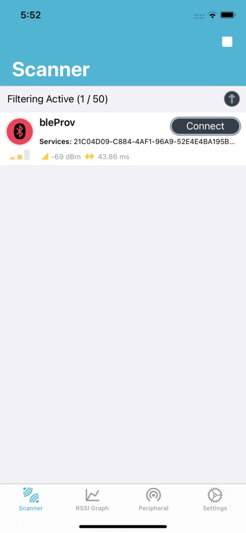 

   4. Select service UUID:21C04D09-xxxx, then:
      1. Select characteristic **1E500043-6B31-4A3D-B91E-025F92CA9763**.
         1. Click upward arrow.
         2. Choose **UTF8** format.
         3. Enter your **Wi-Fi SSID** in a human readable string (for example, "YOURSSID").

            **Figure 5. nRF Connect app flow**

            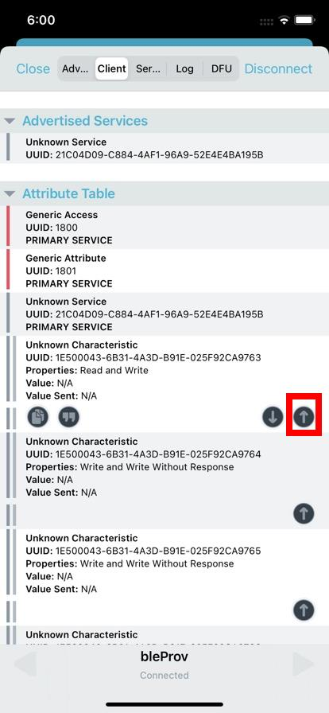 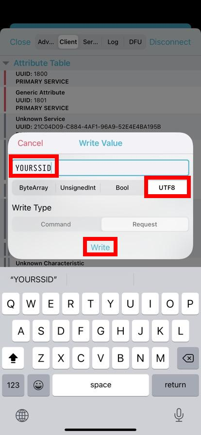 

      2. Select characteristic **1E500043-6B31-4A3D-B91E-025F92CA9764**.
         1. Click upward arrow.
         2. Choose **UTF8** format.
         3. Enter your **Wi-Fi PASSWORD** in a human readable string.

            **Figure 6. nRF Connect app flow**

            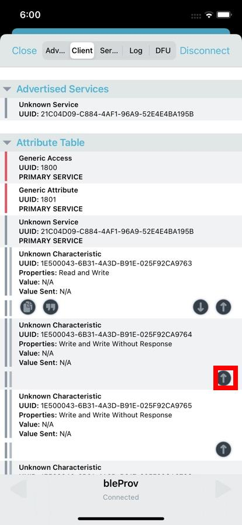 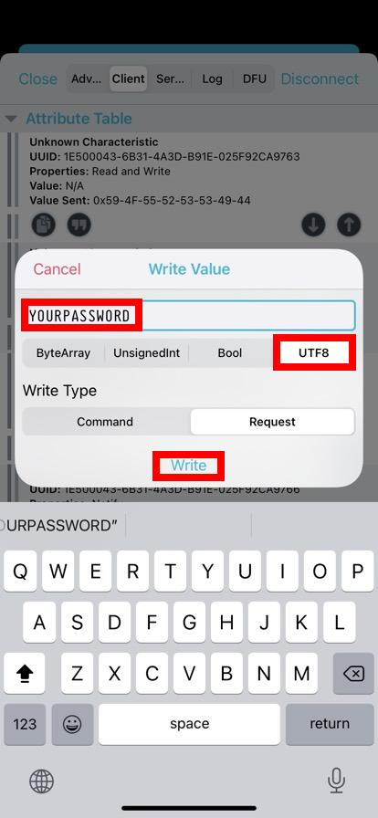 
           
      3. [Optional] Select characteristic **1E500043-6B31-4A3D-B91E-025F92CA9765**.

         1. Click upward arrow.
         2. Choose **ByteArray** format.
         3. Enter your **Wi-Fi SSID and PASSWORD** in **TLV** format.
         For example:
            - Enter following bytes in hex: 0x01 08 57 49 46 49 53 53 49 44 02 08 50 41 53 53 57 4F 52 44
               - **0x01**: The following data is SSID
               - **0x08**: There are eight bytes following
               - 0x57 49 46 49 53 53 49 44: data value, in this case is "WIFISSID"
               - **0x02**: The following data is PASSWORD
               - **0x08**: There are eight bytes following
               - 0x50 41 53 53 57 4F 52 44: Data value, in this case is "PASSWORD"

            **Figure 7. nRF Connect app flow (0x44 is in the end of ByteArray)**

            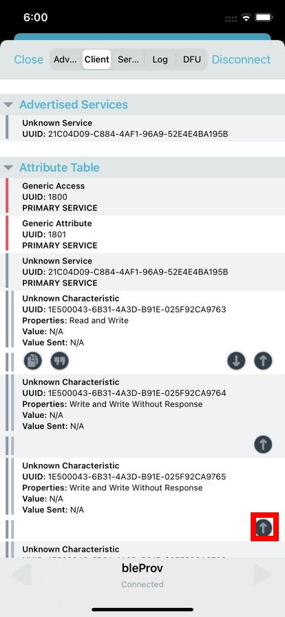 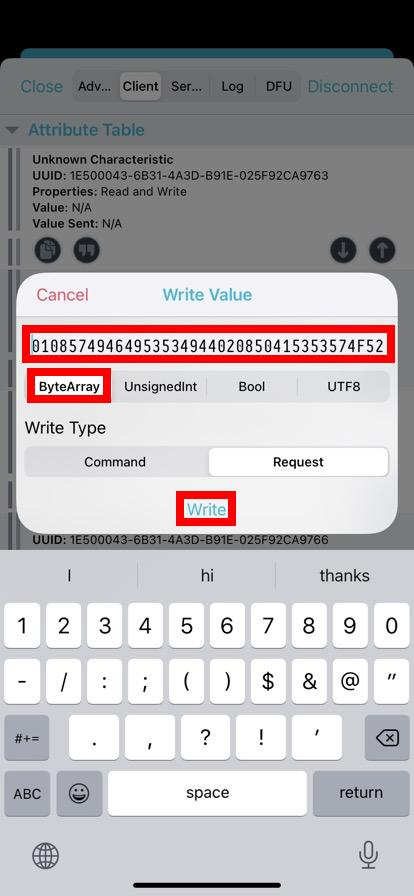 
            
            You will see the following on your console.
            ```
            Current Wi-Fi SSID: WIFISSID
            Current Wi-Fi Password: PASSWORD
            ```
      
      4. [Optional] Subscribe characteristic **1E500043-6B31-4A3D-B91E-025F92CA9766** for starting the Wi-Fi status monitoring and enabling the notification of both Wi-Fi status and Wi-Fi scan results.

         1. Click downward triple arrows to enable the notification and start Wi-Fi monitoring. 

            **Figure 8. nRF Connect app flow**

            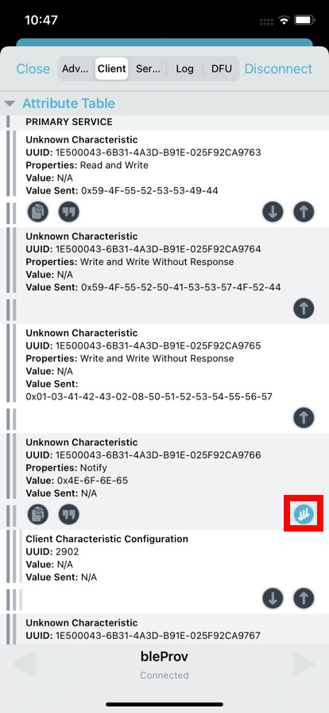 
               

      5. Select characteristic **1E500043-6B31-4A3D-B91E-025F92CA9767**.

         1. Click upward arrow.
         2. Choose **ByteArray** format.
         3. Enter Wi-Fi control command.

            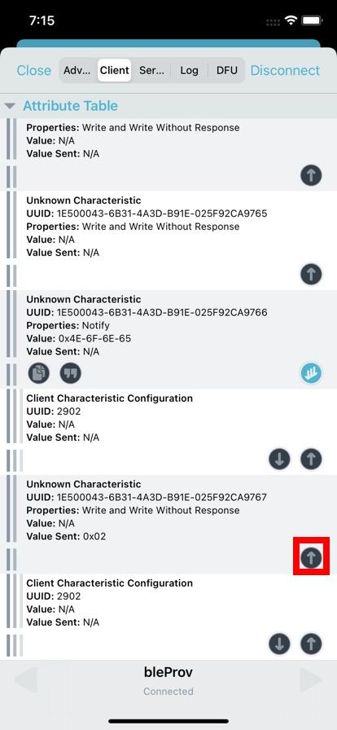  

            - **0x00**: Disconnect from Wi-Fi access point
            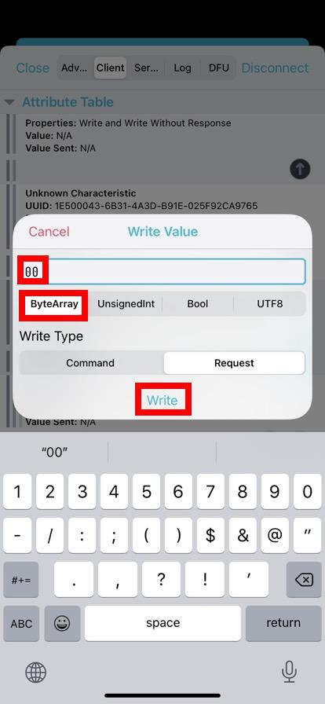 
            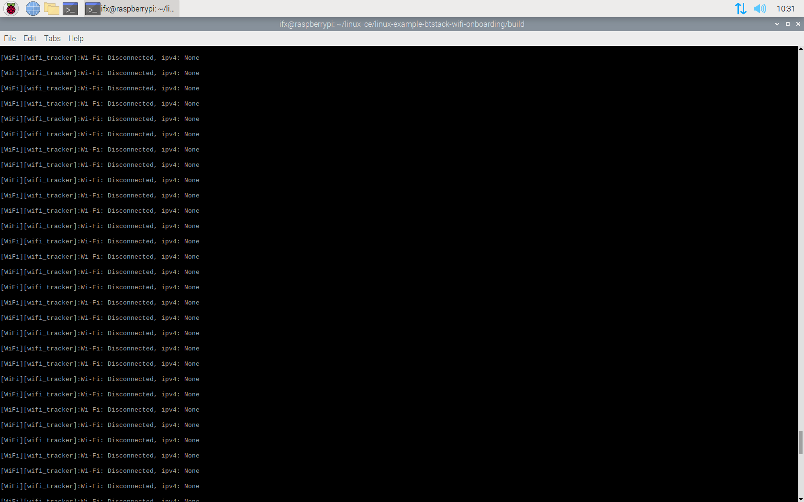

            - **0x01**: Connect to Wi-Fi access point using the saved SSID and PASSWORD
            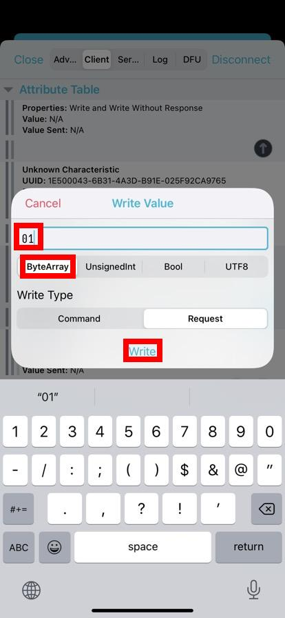 
            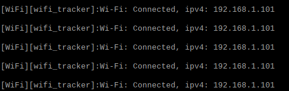

            - **0x02**: [Optional] Wi-Fi scan to get Wi-Fi SSIDs around the target device
            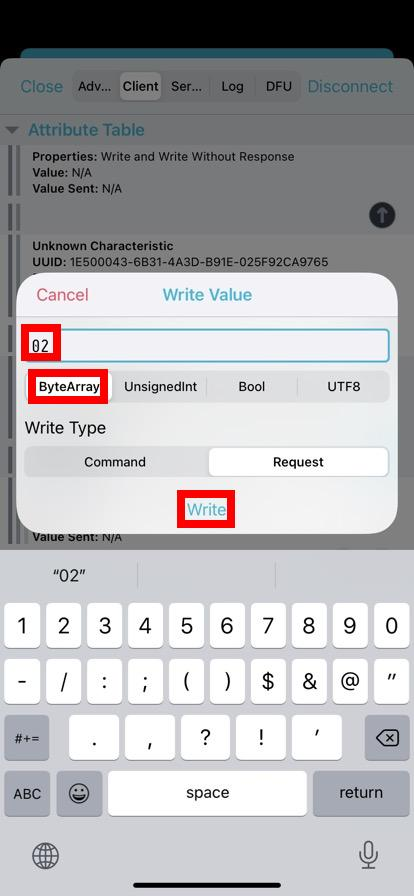 
            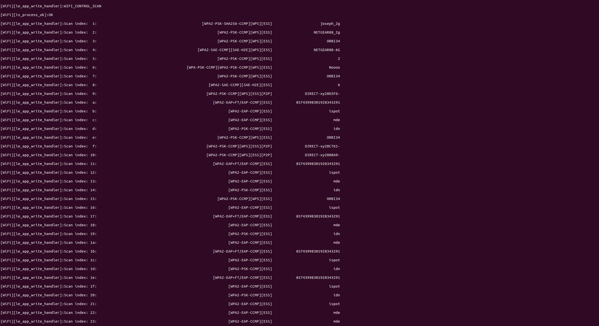  

            - **0x03**: [Optional] Establish Wi-Fi connection with particular scanned index from scan results,notice that the index has already been displayed in hex format. 
            For example:
            **0x03**: connect command
            **0x24**: [**hex**] particular index corresponding to SSID that we want to extablish Wi-Fi connection with.
            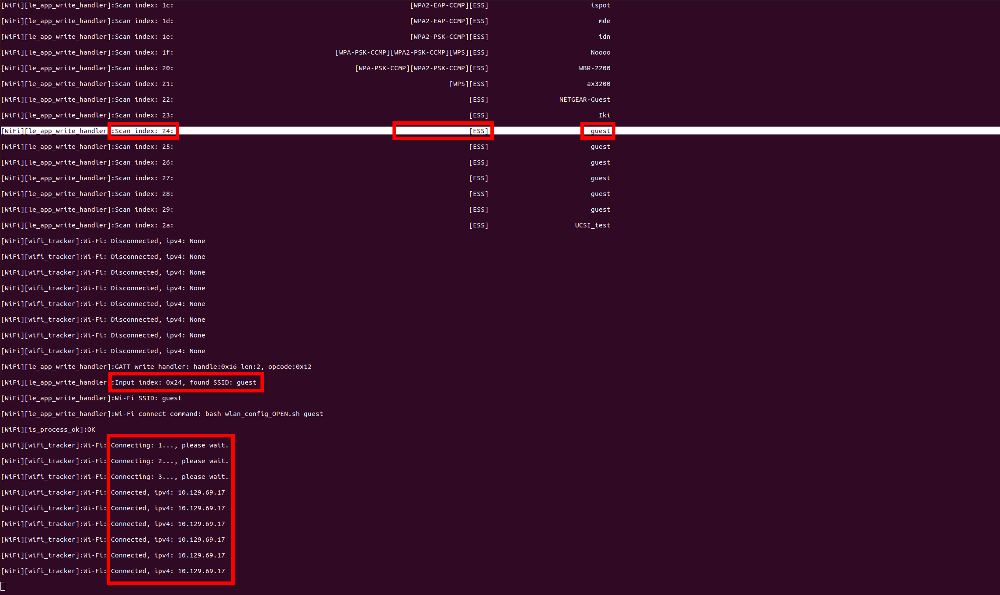
            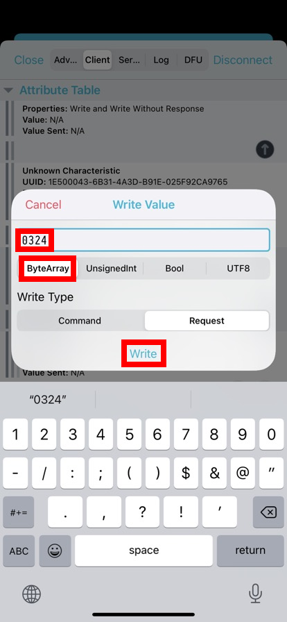  

      6. Showcase the Infineon home page accessed through Wi-Fi connection established by scanned index: 0x42.
            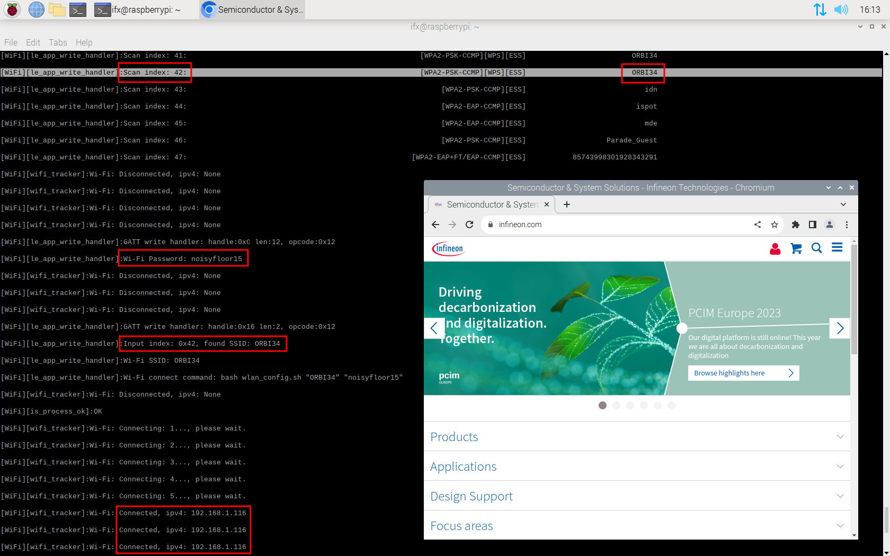        

## Debugging

You can debug the example using a generic Linux debugging mechanism, such as the following:

- **Debugging by logging:** Add prints in the application and check them during the execution.

- **Debugging using GDB:** For more details, See [GDB man page](https://linux.die.net/man/1/gdb).

## Design and implementation

**Roles implemented:**

- **CE code example (implementation under test):** GATT Server and GAP Peripheral role

- **Testing mobile device with LightBlue app/ nRF Connect app:** GATT Client and GAP Central role

This code example does the following:

1. Parses the command-line arguments.

2. Initializes the AIROC™ BTSTACK library for the device.

3. Executing Wi-Fi onboarding application.

## GATT interface and features

This code example demonstrates how to establish a connection with a **WPA2** or **OPEN** Wi-Fi access point.
* Service UUID: **21C04D09-xxxx**
   - characteristic **1E500043-6B31-4A3D-B91E-025F92CA9763**
      - It is used to input **SSID**
   - characteristic **1E500043-6B31-4A3D-B91E-025F92CA9764**
      - It is used to input **PASSWORD**
   - characteristic **1E500043-6B31-4A3D-B91E-025F92CA9765**
      - input SSID and PASSWORD in TLV format
         - TLV stands for "Type" "Length" "Value"
            - Type: The type of following data
               - **0x01**: SSID
               - **0x02**: PASSWORD
            - Length: The length of following data
            - Value: Data in bytes
         - Example:
            - input: **0x01** **08** 57 49 46 49 53 53 49 44 **02** **08** 50 41 53 53 57 4F 52 44
            - **0x01**: The following data is SSID
            - **0x08**: There are eight bytes following
            - 0x57 49 46 49 53 53 49 44: Data value, in this case is "WIFISSID"
            - **0x02**: The following data is PASSWORD
            - **0x08**: There are eight bytes following
            - 0x50 41 53 53 57 4F 52 44: Data value, in this case is "PASSWORD"

   - characteristic **1E500043-6B31-4A3D-B91E-025F92CA9766**
      - Subscribe for monitoring Wi-Fi status and reveiving notification
         - Wi-Fi status will be one of the following:
            - **connected**: Provides ipv4 if it has connected to Wi-Fi access point
            - **disconnected**
         - Wi-Fi scan results in TLV format:
            - Type: The type of following data
               - **0x01**: SSID
               - **0x02**: Security **tag**
                  - **tag** is one of the following:
                     - **WPA2**: 0x00 0x00 0x40 0x00
                     - **Default**: 0xFF 0xFF 0xFF 0xFF
            - Length: The length of following data
            - Value: Data in bytes
            - Example:
               - Receive: **0x01** **08** 57 49 46 49 53 53 49 44 **02** **04** 00 00 40 00
               - **0x01**: The following data is SSID
               - **0x08**: There are eight bytes following
               - 0x57 49 46 49 53 53 49 44: data value, in this case is "WIFISSID"
               - **0x02**: The following data is security tag
               - **0x04**: There are four bytes following
               - 0x00 00 40 00: means it has WPA2          
   - characteristic **1E500043-6B31-4A3D-B91E-025F92CA9767**
      - input control command which is one of following 
         - **0x00**: Disconnect from Wi-Fi access point
         - **0x01**: Connect to Wi-Fi access point using the saved SSID and PASSWORD
         - **0x02**: Wi-Fi scan to get Wi-Fi SSIDs around the target device
            - Example:
               index / tag / **SSID**
               1.  [WPA2]   **CityFree**
               2.  [WPA2]   **friends54377**
               3.  [others]   **ssidking**
         - **0x03**: connect to a corresponding scanned index displayed in the command 0x02's log
            - Example: Send **0x03** **0x03** to establish a connection with index **0x03** which SSID is "ssidking" by previously saved password.

## Source files

 Files   | Description of files
 ------- | ---------------------
 *main.c*  | Implements the main function which takes the user command-line inputs. Uses *arg_parser.c* to parse all the command-line inputs from the user. Calls the *wifi-onboarding.c* functions for all the Find Me profile functionalities.
 *wifi-onboarding.c*  | Implements all functionalities related to WiFi Onboarding.
 *wifi-onboarding.h*  | Header file corresponding to *wifi-onboarding.c*.
 *GeneratedSource*  | All files in this folder are pre-generated using “Bluetooth® Configurator” on Windows. All files in this folder contain configurations related to Bluetooth® settings, GAP, and GATT db.

## Resources and settings

This section explains the Bluetooth® Configurator software resources and their configuration as used in this code example. Note that all the configuration explained in this section has already been done in the code example.

**Bluetooth® Configurator:** The Bluetooth® peripheral has an additional configurator called the “Bluetooth® Configurator” that is used to generate the Bluetooth® LE GATT database and various Bluetooth® settings for the application.

<br />

## Related resources

Resources  | Links
-----------|----------------------------------
Device documentation | [AIROC™ CYW5557x Wi-Fi 6E tri-band Wi-Fi and Bluetooth® 5.2 SoC](https://www.infineon.com/cms/en/product/wireless-connectivity/airoc-wi-fi-plus-bluetooth-combos/cyw5557x/) <br> [AIROC™ CYW54591 Wi-Fi & Bluetooth® combo chip](https://www.infineon.com/cms/en/product/wireless-connectivity/airoc-wi-fi-plus-bluetooth-combos/wi-fi-5-802.11ac/cyw54591/) <br> [AIROC™ CYW43439 Wi-Fi & Bluetooth® combo chip](https://www.infineon.com/cms/en/product/wireless-connectivity/airoc-wi-fi-plus-bluetooth-combos/wi-fi-4-802.11n/cyw43439/) <br> [AIROC™ CYW43012 Wi-Fi & Bluetooth® combo chip](https://www.infineon.com/cms/en/product/wireless-connectivity/airoc-wi-fi-plus-bluetooth-combos/wi-fi-4-802.11n/cyw43012/)
Libraries and middleware | [AIROC™ BTSTACK library](https://github.com/Infineon/btstack/tree/release-v3.6.1) <br> [BT Audio profile layer](https://github.com/Infineon/bt-audio-profiles/tree/release-v1.0.0) <br> [Linux porting layer source code](https://github.com/Infineon/bluetooth-linux)


## Other resources

Infineon provides a wealth of data at www.infineon.com to help you select the right device, and quickly and effectively integrate it into your design.

## Document history

Document title: *CE236728* – *AIROC™ BTSTACK: Bluetooth® Wi-Fi Onboarding for Linux host*

 Version | Description of change
 ------- | ---------------------
 1.0.0   | New code example

<br />

---------------------------------------------------------

© Cypress Semiconductor Corporation, 2023. This document is the property of Cypress Semiconductor Corporation, an Infineon Technologies company, and its affiliates ("Cypress").  This document, including any software or firmware included or referenced in this document ("Software"), is owned by Cypress under the intellectual property laws and treaties of the United States and other countries worldwide.  Cypress reserves all rights under such laws and treaties and does not, except as specifically stated in this paragraph, grant any license under its patents, copyrights, trademarks, or other intellectual property rights.  If the Software is not accompanied by a license agreement and you do not otherwise have a written agreement with Cypress governing the use of the Software, then Cypress hereby grants you a personal, non-exclusive, nontransferable license (without the right to sublicense) (1) under its copyright rights in the Software (a) for Software provided in source code form, to modify and reproduce the Software solely for use with Cypress hardware products, only internally within your organization, and (b) to distribute the Software in binary code form externally to end users (either directly or indirectly through resellers and distributors), solely for use on Cypress hardware product units, and (2) under those claims of Cypress’s patents that are infringed by the Software (as provided by Cypress, unmodified) to make, use, distribute, and import the Software solely for use with Cypress hardware products.  Any other use, reproduction, modification, translation, or compilation of the Software is prohibited.
<br />
TO THE EXTENT PERMITTED BY APPLICABLE LAW, CYPRESS MAKES NO WARRANTY OF ANY KIND, EXPRESS OR IMPLIED, WITH REGARD TO THIS DOCUMENT OR ANY SOFTWARE OR ACCOMPANYING HARDWARE, INCLUDING, BUT NOT LIMITED TO, THE IMPLIED WARRANTIES OF MERCHANTABILITY AND FITNESS FOR A PARTICULAR PURPOSE.  No computing device can be absolutely secure.  Therefore, despite security measures implemented in Cypress hardware or software products, Cypress shall have no liability arising out of any security breach, such as unauthorized access to or use of a Cypress product. CYPRESS DOES NOT REPRESENT, WARRANT, OR GUARANTEE THAT CYPRESS PRODUCTS, OR SYSTEMS CREATED USING CYPRESS PRODUCTS, WILL BE FREE FROM CORRUPTION, ATTACK, VIRUSES, INTERFERENCE, HACKING, DATA LOSS OR THEFT, OR OTHER SECURITY INTRUSION (collectively, "Security Breach").  Cypress disclaims any liability relating to any Security Breach, and you shall and hereby do release Cypress from any claim, damage, or other liability arising from any Security Breach.  In addition, the products described in these materials may contain design defects or errors known as errata which may cause the product to deviate from published specifications. To the extent permitted by applicable law, Cypress reserves the right to make changes to this document without further notice. Cypress does not assume any liability arising out of the application or use of any product or circuit described in this document. Any information provided in this document, including any sample design information or programming code, is provided only for reference purposes.  It is the responsibility of the user of this document to properly design, program, and test the functionality and safety of any application made of this information and any resulting product.  "High-Risk Device" means any device or system whose failure could cause personal injury, death, or property damage.  Examples of High-Risk Devices are weapons, nuclear installations, surgical implants, and other medical devices.  "Critical Component" means any component of a High-Risk Device whose failure to perform can be reasonably expected to cause, directly or indirectly, the failure of the High-Risk Device, or to affect its safety or effectiveness.  Cypress is not liable, in whole or in part, and you shall and hereby do release Cypress from any claim, damage, or other liability arising from any use of a Cypress product as a Critical Component in a High-Risk Device. You shall indemnify and hold Cypress, including its affiliates, and its directors, officers, employees, agents, distributors, and assigns harmless from and against all claims, costs, damages, and expenses, arising out of any claim, including claims for product liability, personal injury or death, or property damage arising from any use of a Cypress product as a Critical Component in a High-Risk Device. Cypress products are not intended or authorized for use as a Critical Component in any High-Risk Device except to the limited extent that (i) Cypress’s published data sheet for the product explicitly states Cypress has qualified the product for use in a specific High-Risk Device, or (ii) Cypress has given you advance written authorization to use the product as a Critical Component in the specific High-Risk Device and you have signed a separate indemnification agreement.
<br />
Cypress, the Cypress logo, and combinations thereof, WICED, ModusToolbox, PSoC, CapSense, EZ-USB, F-RAM, and Traveo are trademarks or registered trademarks of Cypress or a subsidiary of Cypress in the United States or in other countries. For a more complete list of Cypress trademarks, visit www.infineon.com. Other names and brands may be claimed as property of their respective owners.
